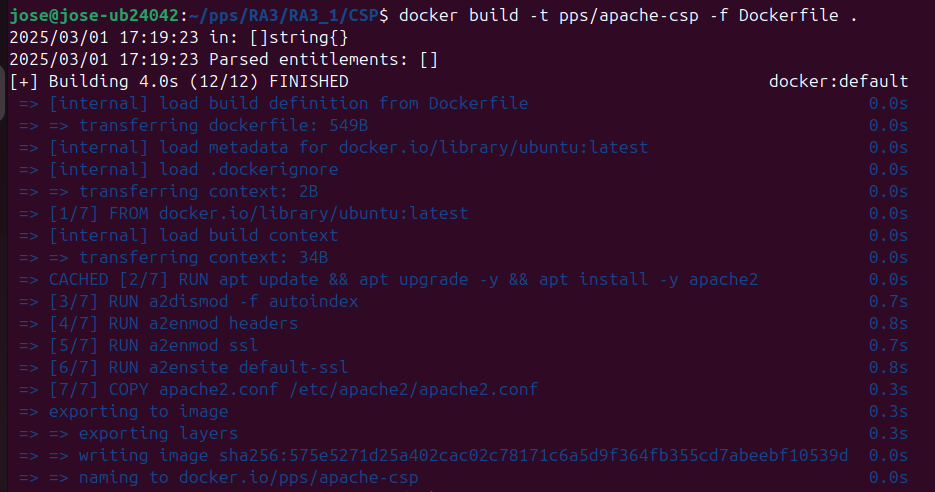
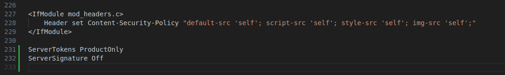
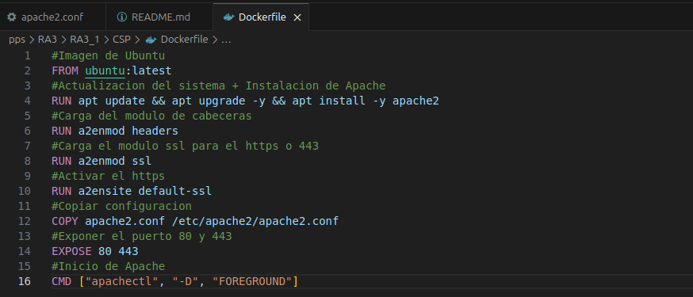
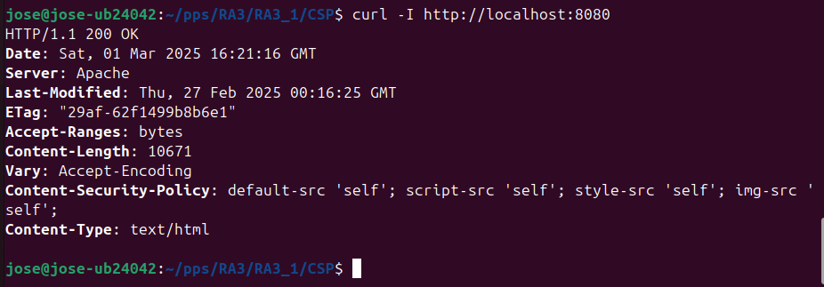

# Content Security Policy (CSP)

## **🔹 Descripción**
En esta práctica, se implementa **Content Security Policy (CSP)** en un servidor Apache dentro de un contenedor Docker. CSP ayuda a mitigar ataques como **Cross-Site Scripting (XSS)** y restringe qué recursos pueden cargarse en la aplicación web.

La configuración establece que:
- Solo se pueden cargar recursos desde el mismo dominio (`self`).
- Se bloquea la ejecución de scripts de terceros.
- Se impide la carga de imágenes, hojas de estilo y scripts desde fuentes externas no confiables.

---

## **🔹 Modificaciones Realizadas**

### ** 1 Archivo `apache2.conf` (Configuración de Apache)**
Se modifico el archivo `/etc/apache2/conf-available/apache2.conf` con el siguiente contenido al final del mismo:

```apache
<IfModule mod_headers.c>
    Header set Content-Security-Policy "default-src 'self'; script-src 'self'; style-src 'self'; img-src 'self';"
</IfModule>
```
**Efecto:** Solo permite cargar contenido del mismo dominio (`self`), bloqueando scripts o estilos externos.

Ademas añadiremos las lineas: 
```
ServerTokens ProductOnly
ServerSignature Off
```
**Efecto:** Con esto conseguiremos que cuando comprobremos los headers Apache no muestre su firma y detalles de la versión en las respuestas HTTP y páginas de error.

---

### ** 2️ Archivo `Dockerfile` (Dockerización de CSP)**
Se creó el `Dockerfile` con la siguiente configuración:

```dockerfile
#Imagen de Ubuntu
FROM ubuntu:latest

#Actualizacion del sistema + Instalacion de Apache
RUN apt update && apt upgrade -y && apt install -y apache2

#Carga del modulo de cabeceras
RUN a2enmod headers

#Carga el modulo ssl para el https o 443
RUN a2enmod ssl

#Activar el https
RUN a2ensite default-ssl

#Copiar configuracion 
COPY apache2.conf /etc/apache2/apache2.conf

#Exponer el puerto 80 y 443 
EXPOSE 80 443

#Inicio de Apache
CMD ["apachectl", "-D", "FOREGROUND"]
```
**Efecto:** Crea un contenedor con Apache y la política CSP activada, además de permitir conexiones en HTTP (80) como en HTTPS (443).

---

## **🔹 Validación**
Para verificar que CSP está correctamente configurado en el contenedor:

1. **Construir la imagen Docker**:
   ```sh
   docker build -t pps/apache-csp -f Dockerfile .
   ```
2. **Ejecutar el contenedor**:
   ```sh
   docker run -d -p 8080:80 -p 8443:443 pps/apache-csp
   ```
3. **Comprobar si la política CSP está aplicada**:
   ```sh
   curl -I http://localhost:8080
   ```
    **Salida esperada** (Debe incluir la cabecera `Content-Security-Policy`):
   ```
   Content-Security-Policy: default-src 'self'; script-src 'self'; style-src 'self'; img-src 'self';
   ```

---

## **🔹 Capturas de Pantalla**
  
  Captura de la modificaion del archivo de configuracion del apache:  
  
  
  Captura del apache2.conf:  
  

  Captura del Dockerfile:  
  
  
  
  Comprobacion del servicio:  
  
 

---

## **🔹 Pull del Contenedor en Docker Hub**
Cuando Docker Hub esté configurado, la imagen podrá descargarse con:
```sh
docker pull pps13030596/pps:csp
```

---
