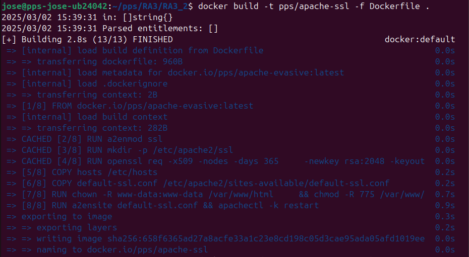
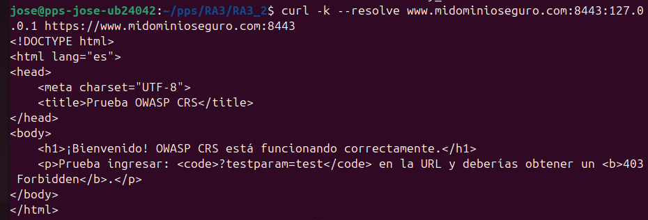
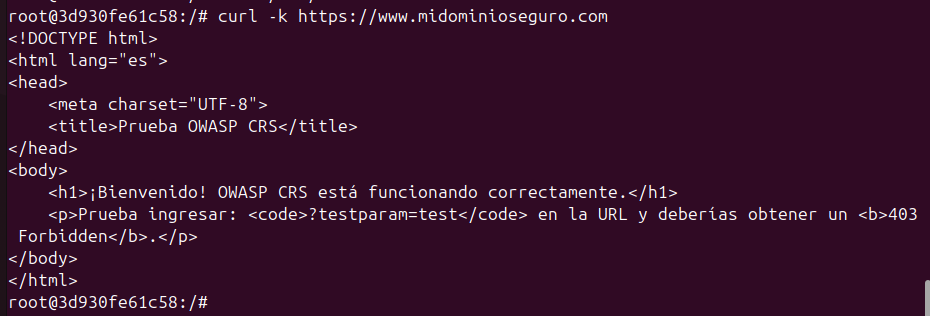

# Implementación de SSL en Apache con Docker

## ** Descripción**
En esta sección, se ha configurado **SSL en Apache** mediante un **certificado autofirmado** para permitir conexiones seguras HTTPS. Se ha desplegado dentro de un contenedor Docker basado en `pps/apache-evasive`.

## ** Pasos Realizados**

### ** 1 Generación de un Certificado SSL Autofirmado**
El certificado SSL se generó automáticamente dentro del contenedor utilizando:
```sh
openssl req -x509 -nodes -days 365 -newkey rsa:2048 \
    -keyout /etc/apache2/ssl/apache.key -out /etc/apache2/ssl/apache.crt \
    -subj "/C=ES/ST=Castellon/L=CastellondelaPlana/O=IESelCaminas/OU=EspecializacionCiberseguridad/CN=www.midominioseguro.com"
```
 **Esto crea un certificado válido por 1 año para `www.midominioseguro.com`.**

### ** 2 Configuración del VirtualHost para HTTPS**
Se ha configurado **`default-ssl.conf`** con la siguiente configuración para habilitar SSL:
```apache
<IfModule mod_ssl.c>
    <VirtualHost _default_:443>
        ServerAdmin admin@midominioseguro.com
        ServerName www.midominioseguro.com
        DocumentRoot /var/www/html
        ErrorLog ${APACHE_LOG_DIR}/error.log
        CustomLog ${APACHE_LOG_DIR}/access.log combined
        SSLEngine on
        SSLCertificateFile /etc/apache2/ssl/apache.crt
        SSLCertificateKeyFile /etc/apache2/ssl/apache.key
        <FilesMatch "\.(cgi|shtml|phtml|php)$">
                        SSLOptions +StdEnvVars
        </FilesMatch>
        <Directory /usr/lib/cgi-bin>
                        SSLOptions +StdEnvVars
        </Directory>
        BrowserMatch "MSIE [2-6]" \
                        nokeepalive ssl-unclean-shutdown \
                        downgrade-1.0 force-response-1.0
        BrowserMatch "MSIE [17-9]" ssl-unclean-shutdown
    </VirtualHost>
</IfModule>
```
 **Esto asegura que Apache sirva contenido cifrado en el puerto 443.**

### ** 3 Creación de la Imagen Docker con SSL**
Se ha modificado el `Dockerfile` para incluir `mod_ssl` y generar el certificado:
```dockerfile
# Usa la imagen con mod_evasive y OWASP CRS como base
FROM pps/apache-evasive

# Activar el módulo SSL en Apache
RUN a2enmod ssl

# Crear directorio para los certificados SSL
RUN mkdir -p /etc/apache2/ssl

# Generar certificado SSL autofirmado dentro del contenedor
RUN openssl req -x509 -nodes -days 365 \
    -newkey rsa:2048 -keyout /etc/apache2/ssl/apache.key -out /etc/apache2/ssl/apache.crt \
    -subj "/C=ES/ST=Castellon/L=CastellondelaPlana/O=IESelCaminas/OU=EspecializacionCiberseguridad/CN=www.midominioseguro.com"

COPY hosts /etc/hosts
# Copiar configuración de Apache para SSL
COPY default-ssl.conf /etc/apache2/sites-available/default-ssl.conf

#Asignar permisos adecuados
RUN chown -R www-data:www-data /var/www/html \
    && chmod -R 775 /var/www/html 

# Habilitar el sitio SSL en Apache
RUN a2ensite default-ssl.conf && apachectl -k restart

# Reiniciar Apache
CMD ["apache2ctl", "-D", "FOREGROUND"]
```
 **Esto permite que el servidor Apache se inicie con SSL activo y configurado correctamente.**

### ** 4 Construcción y Ejecución del Contenedor**
Ejecutamos los siguientes comandos para construir y probar la imagen Docker:
```sh
docker build -t pps/apache-ssl -f Dockerfile .
docker run -d -p 443:443 pps/apache-ssl
```

### ** 5 Pruebas de Conectividad SSL**
Se realizaron pruebas de conexión HTTPS con `curl`:
```sh
curl -k https://localhost:443
```
 **El servidor responde correctamente en HTTPS.**

También verificamos la conexión desde dentro del contenedor:
```sh
docker exec -it <ID_CONTENEDOR> curl -k https://www.midominioseguro.com
```
 **El dominio `www.midominioseguro.com` se resuelve correctamente en el contenedor.**

## **🔹 Capturas de Pantalla**
  
  Construccion de la imagen:  
  
  
  Captura curl Exterior:  
  

  Captura curl Interior:  
  

---
## **🔹 Pull del Contenedor en Docker Hub**
Cuando Docker Hub esté configurado, la imagen podrá descargarse con:
```sh
docker pull https://hub.docker.com/repository/docker/pss13030596/apache2-ssl
```

---