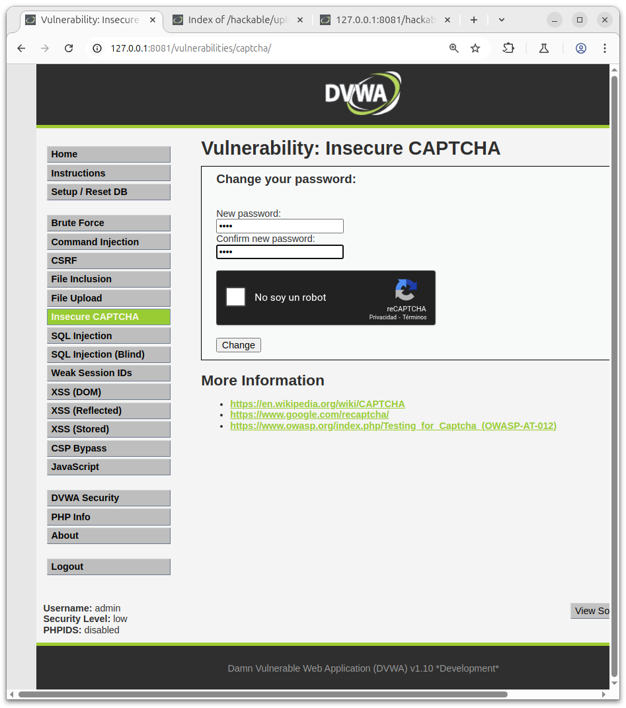
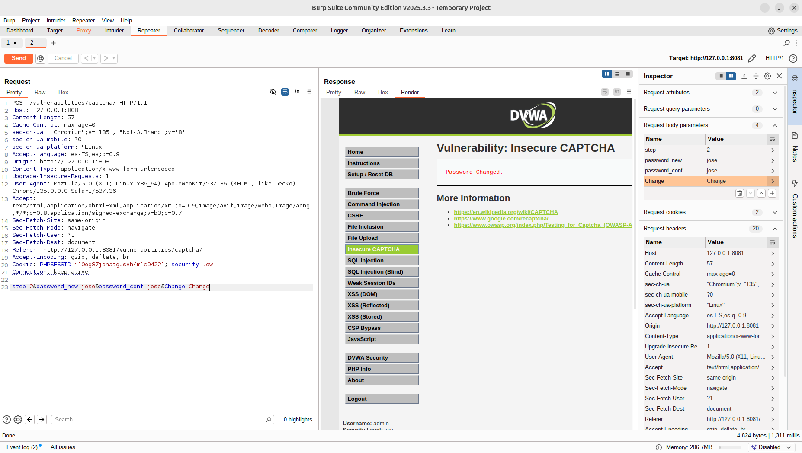
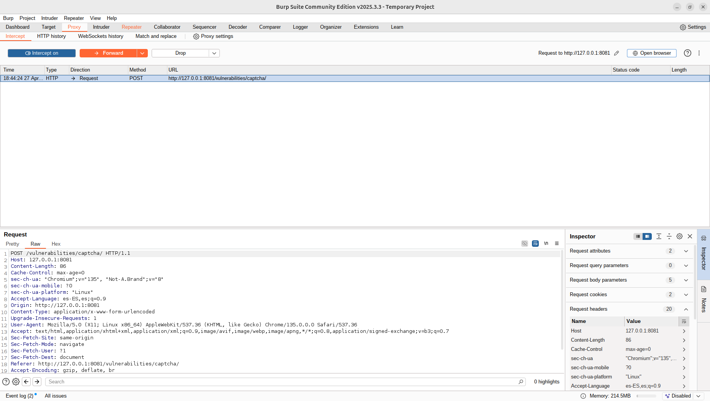
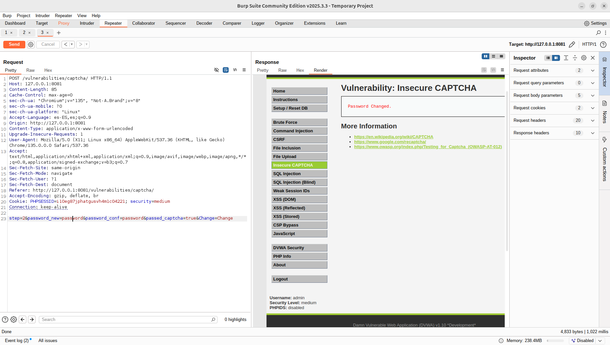
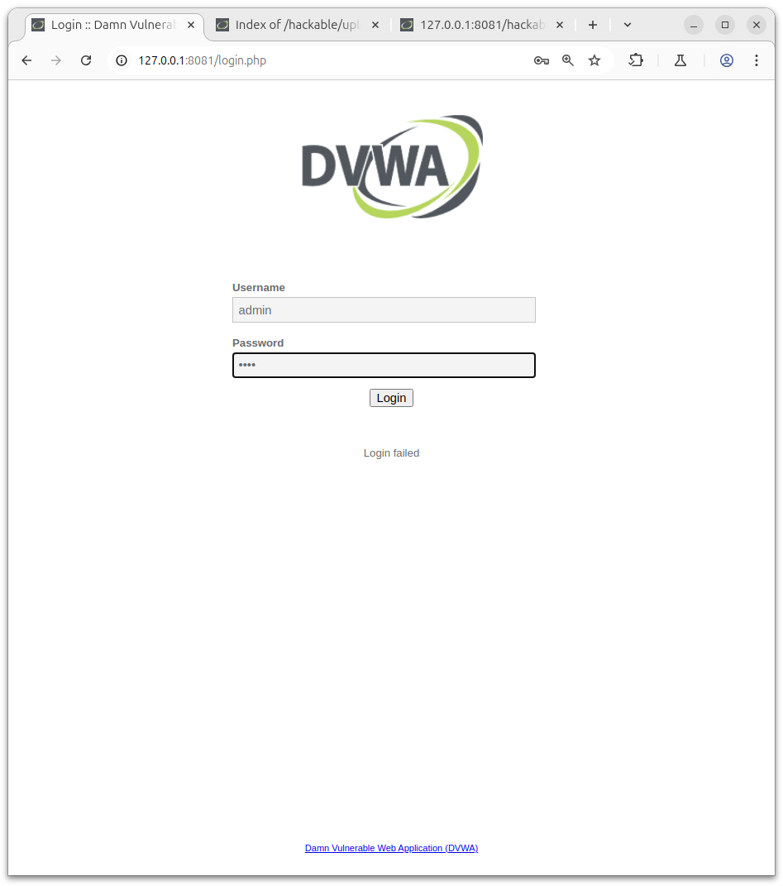

# Actividad: Bypass de Insecure CAPTCHA en DVWA (adaptado)

---

## Objetivo
Realizar un ataque para cambiar la contraseña en DVWA en el módulo **Insecure CAPTCHA**, explotando vulnerabilidades de validación, usando **Burp Suite** para capturar y modificar el tráfico.

---

## Procedimiento paso a paso - Seguridad low

### 1. Acceso a la aplicación
- Iniciar sesión en **DVWA** con las credenciales habituales.
- Navegar a la sección:
  ```
  Vulnerabilities > Insecure CAPTCHA
  ```

---

### 2. Intentar cambiar la contraseña
- En la sección de cambio de contraseña, introducir:
  - Nueva contraseña: `jose`
  - Confirmación: `jose`

(No importa el valor del captcha en este momento.)

---

### 3. Capturar la solicitud con Burp Suite

- Asegurar que **Burp Suite** esté activo y configurado como proxy.
- Interceptar la petición al enviar el formulario de cambio de contraseña.
- Una vez capturada, **enviar la solicitud al Repeater** (clic derecho > Send to Repeater).

Captura:



---

### 4. Modificar la solicitud en el Repeater

- Dentro de **Repeater**, en la pestaña **Request**, localizar el fragmento:
  ```
  step=1&password_new=paco&password_conf=paco&Change=Change
  ```
- Modificarlo para que quede así:
  ```
  step=2&password_new=jose&password_conf=jose&Change=Change
  ```

De esta forma estamos forzando la aplicación a pasar directamente al paso final, eludiendo el captcha.

Cambios en el Buropsuite



---

### 5. Verificar la respuesta

- En **Repeater**, enviar la solicitud modificada.
- Observar la pestaña **Response** > **Render**.
- Confirmar que aparece un mensaje indicando que la contraseña se ha cambiado exitosamente **sin necesidad de resolver el captcha**.

Comprobacion:


---

## Explotación de Insecure CAPTCHA en DVWA (Nivel Medium)

---

## Contexto

En el nivel **Medium** de la vulnerabilidad **Insecure CAPTCHA** de DVWA, el sistema introduce un nuevo parámetro llamado `passed_captcha=true` que controla si se ha superado el captcha. Esta verificación puede ser manipulada manualmente.

Aunque el flujo cambia ligeramente respecto al nivel "Low", la vulnerabilidad persiste debido a que no se valida correctamente en el servidor.

---

## Procedimiento adaptado

### 1. Acceso inicial

- Iniciar sesión en **DVWA**.
- Navegar a:
  ```
  Vulnerabilities > Insecure CAPTCHA
  ```

### 2. Interceptar la solicitud de cambio de contraseña

Introducir:

Nueva contraseña: password

Confirmación: password

(No resolver correctamente el captcha de momento).

Capturar la solicitud con Burp Suite Proxy.

Enviar la solicitud al Repeater para modificarla.

Captura del proxy en medium:



### 3. Modificar la petición en Repeater

En la solicitud capturada, localizar el fragmento:
```
html
step=2&password_new=pakillo&password_conf=pakillo&Change=Change
```
Modificarlo para añadir el nuevo parámetro passed_captcha=true, quedando así:
```
html
step=2&password_new=pakillo&password_conf=pakillo&passed_captcha=true&Change=Change
```
Esta manipulación simula que el captcha ha sido resuelto exitosamente, sin necesidad de introducir el código correcto.

### 4. Ejecutar la petición modificada

Desde Repeater, enviar la solicitud.

Observar en Response > Render que la contraseña ha sido actualizada satisfactoriamente.

El sistema no valida correctamente el flujo y permite el cambio de contraseña simplemente por modificar un parámetro en la petición.

Captura de este paso y el anterior:



### 5.Comprobacion final

Comprobamos la contraseña anterior obteniendo un resultado negativo:



## Resultado esperado

- La contraseña es cambiada sin resolver el captcha de forma legítima.
- Se confirma la vulnerabilidad de tipo **Insecure CAPTCHA** en nivel Medium.

---

