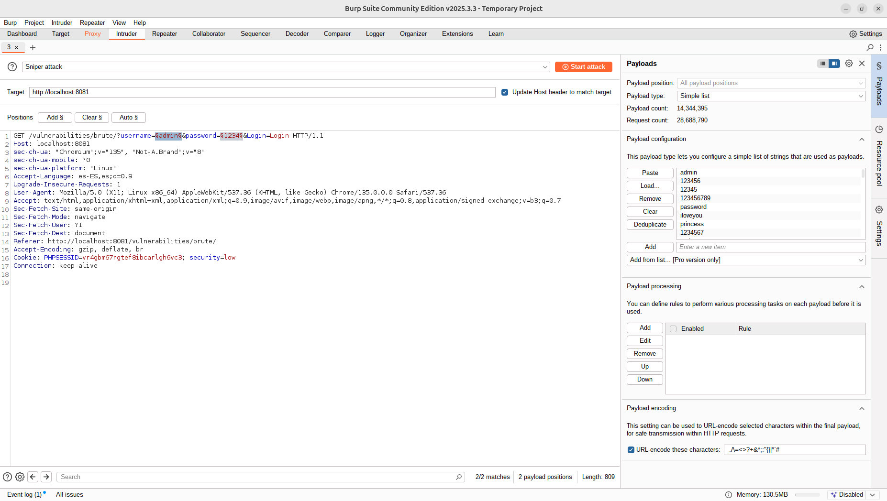
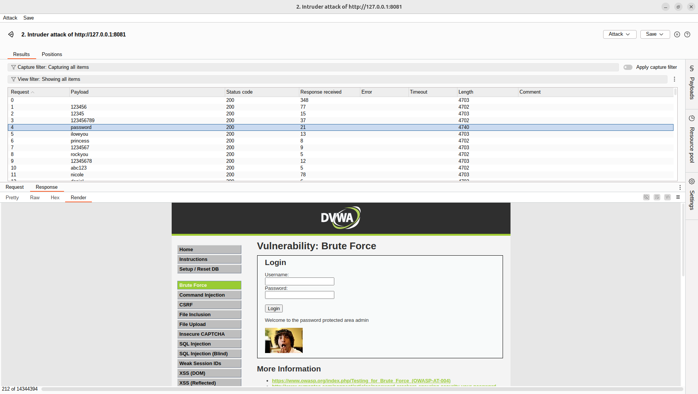
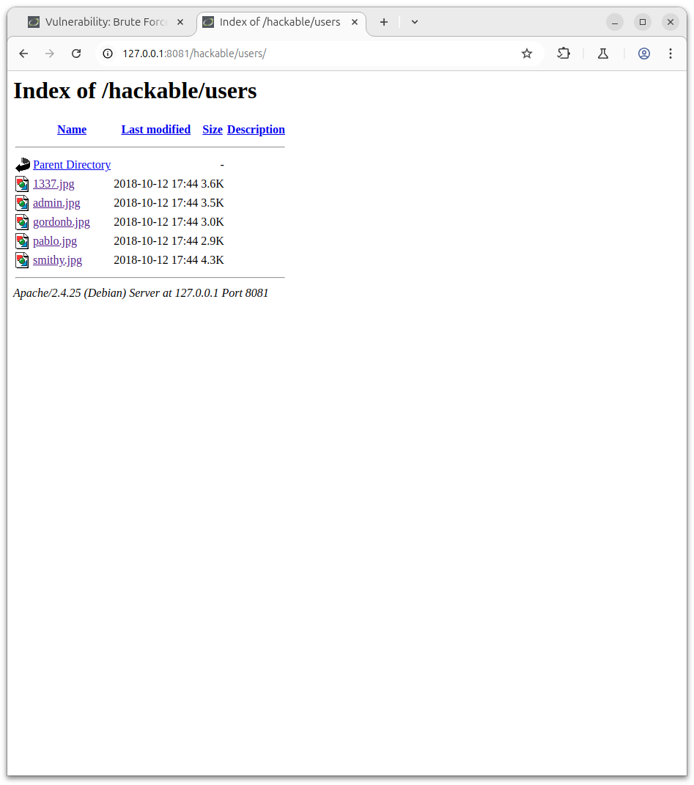

# DVWA BRUTE FORCE

## DVWA Brute Force en Low Security

### Pasos en low:

1. Capturar la solicitud de login fallido

En Burp Suite:

Activar el Proxy (Intercept ON).

En DVWA, ir a: Vulnerabilities > Brute Force

Introducir:

Usuario: admin

Contraseña: cualquier

Hacer clic en Login.

Burp interceptará la solicitud.

2. Enviar la petición a Intruder

En Burp Proxy:

Botón derecho sobre la solicitud → Send to Intruder.

Ir a la pestaña Intruder.

3. Configurar posiciones en Intruder

En la pestaña Positions:

Pulsar Clear para eliminar posiciones automáticas.

Seleccionar el valor de username y password.

Clic en Add § sobre ambos.

El cuerpo del POST debe verse como:

username=§admin§&password=§cualquier§&Login=Login

4. Configurar payloads

En la pestaña Payloads:

Payload (Password):

Tipo: Simple list

Cargar un archivo de contraseñas (rockyou.txt) o añadirlas manualmente.

Vista de los cambios en Intruder en BurpSuite:

6. Lanzar el ataque

Pulsar Start Attack.

Observar los resultados:

Analizar la columna Length y si nuestra version lo permite filtrar con la palabra "Welcome".

Cuando el tamaño de la respuesta cambie, probablemente el login haya sido exitoso o podemos repasar las respuestas en busca del que este logeado.

También se puede observar el Status Code o analizar manualmente cada respuesta.

Resultado del Ataque:

7. Extra 

Si inspecionamos la imagen y elemininamos el nombre de la barra de direcciones, veremos que podemos observar el resto de imagenes ya dando nos pistas de los otros usuarios. Desde punto solo tendriamos que replicar los anteriores pasos para conseguir la contraseña. Captura continuacion:

Otros Usuarios:

