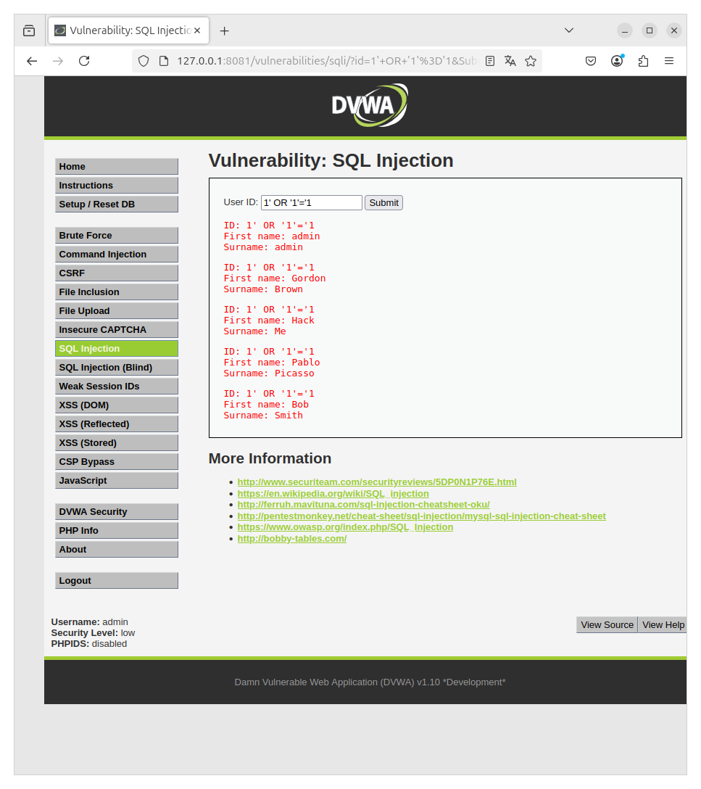
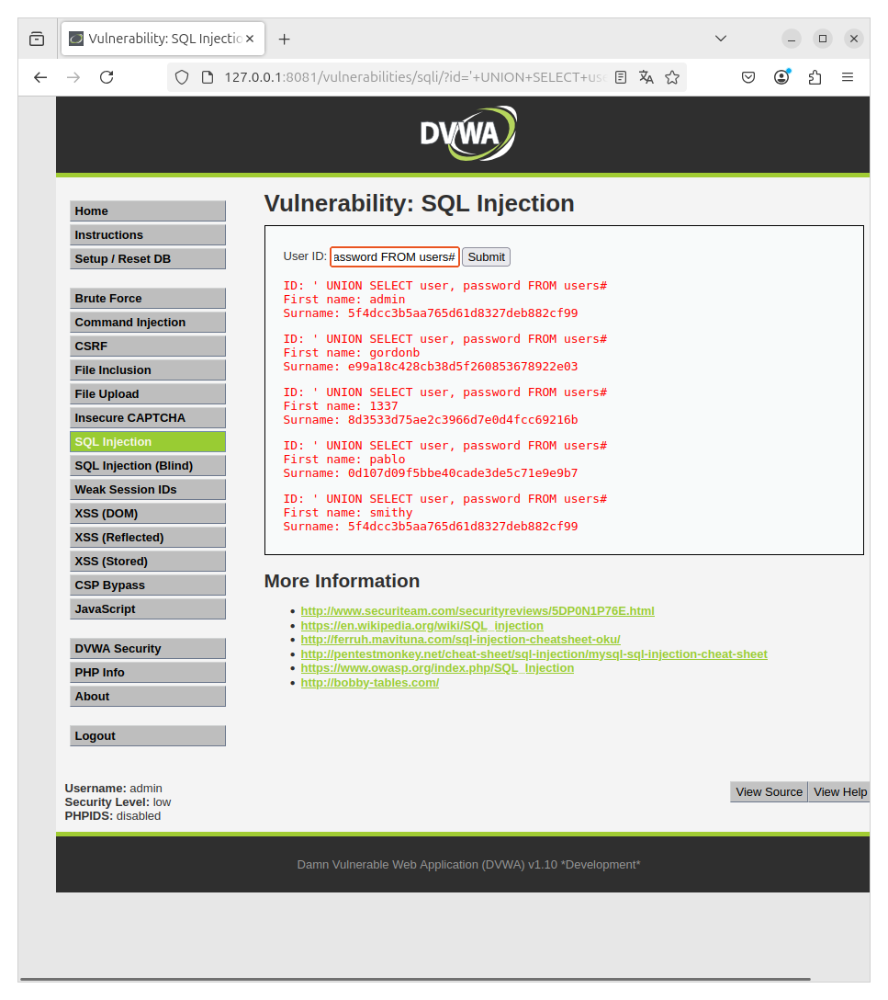
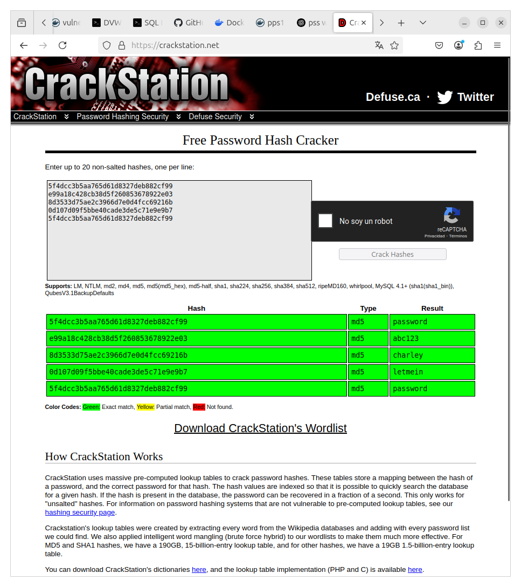

## SQL Injection en **Low** Security

### Pasos:

1. Ve al menú izquierdo y selecciona **SQL Injection**.
2. En el campo **User ID**, ingresa el siguiente payload:

```sql
1' OR '1'='1
```

Con el anterior payload hemos consegido los usuarios como vemos en la siguiente captura:



Ahora necesitaremos obtener las contraseñas, para ellos usaremos el siguiente payload:

```sql
' UNION SELECT user, password FROM users#
```
captura:



Y para finalizar tendremos que transformar los hashes en texto plano, podriamos usar "jhon the ripper" o por ejemplo yo he usado una web 

[Crackstation](https://crackstation.net/)

captura de las contraseñas en plano:



## SQL Injection en **Medium** Security

### Pasos:
