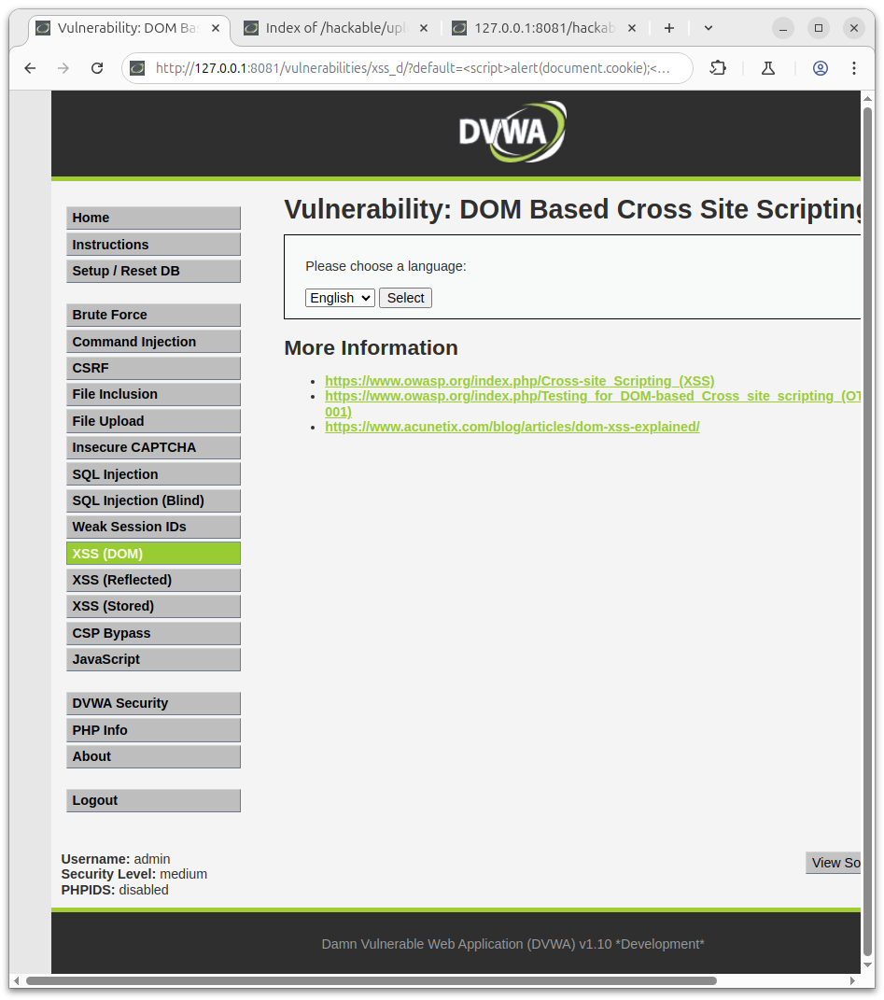
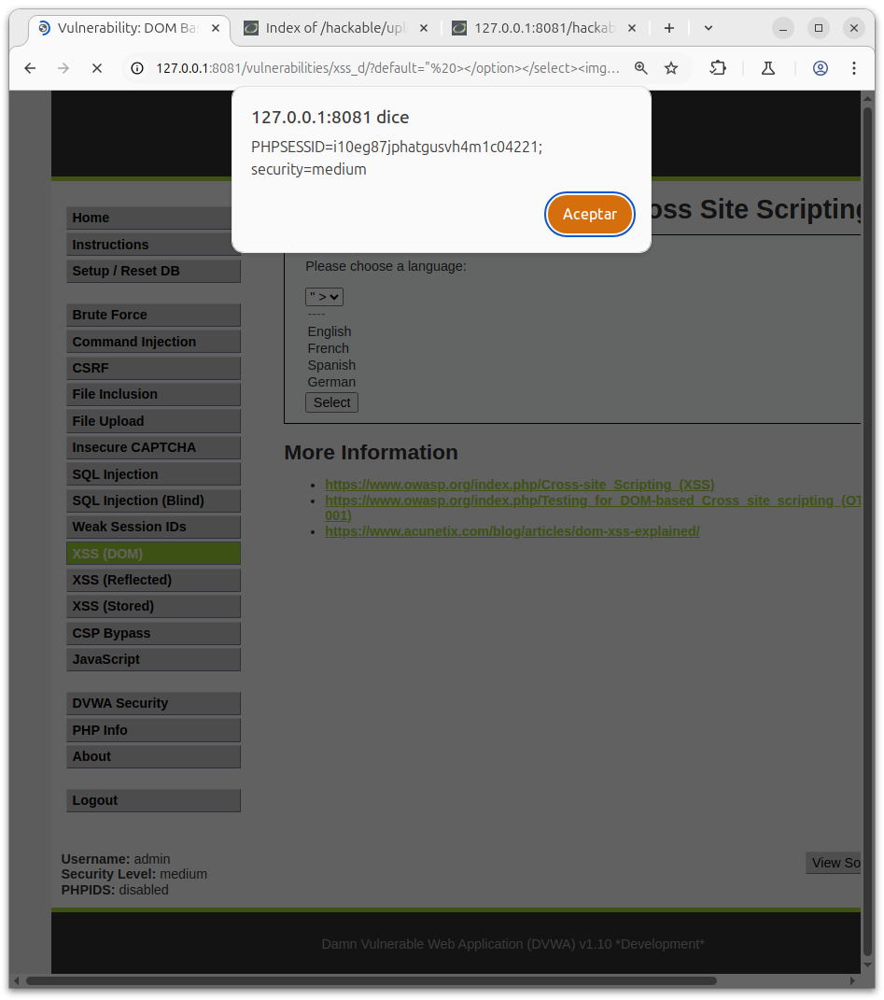
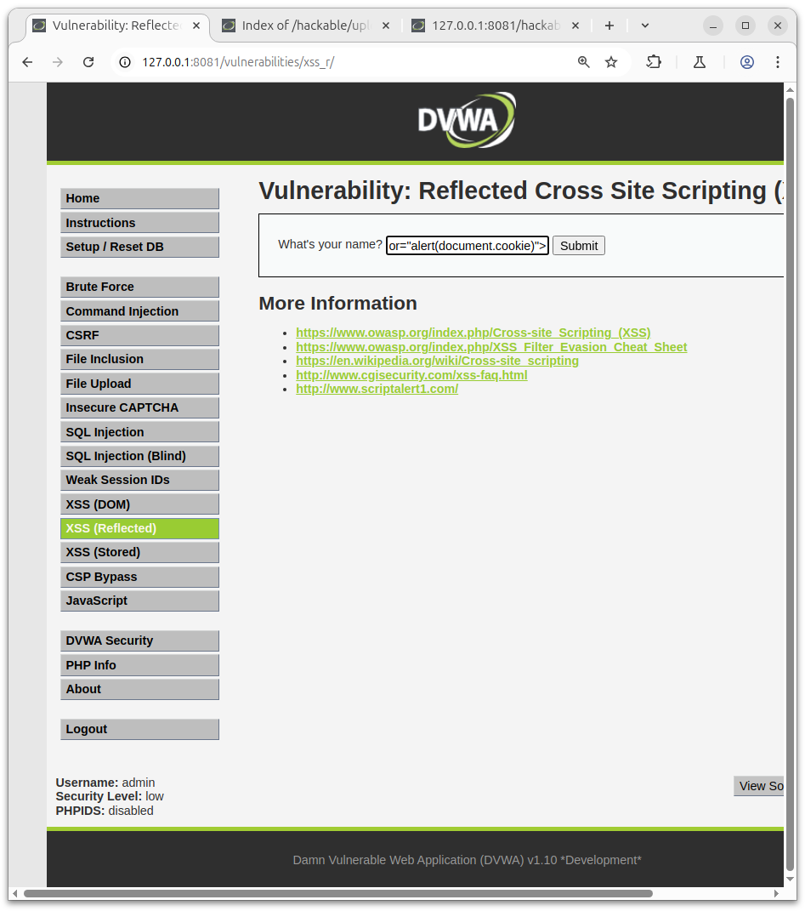
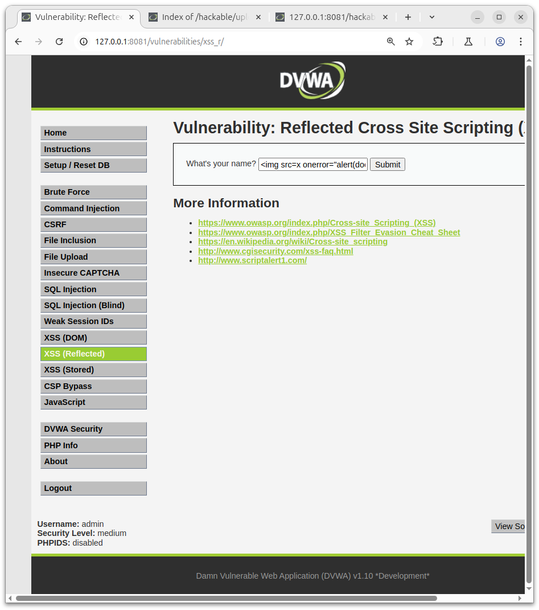
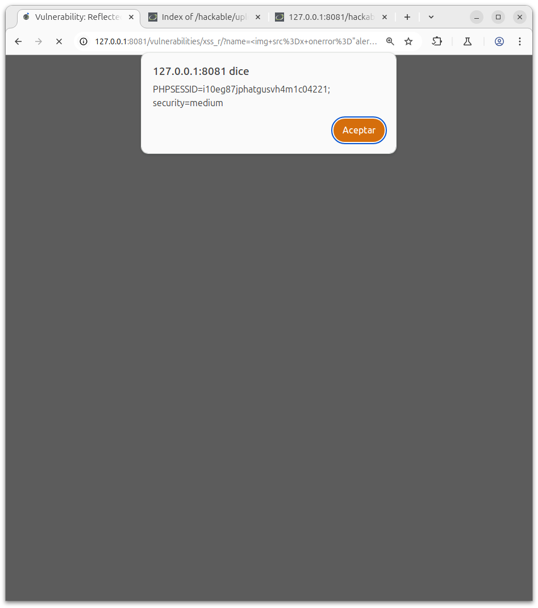

# Explotación de XSS Basado en DOM en DVWA

# Nivel de Seguridad: Low

## Observación

Existe una opción para seleccionar el idioma.

El valor seleccionado es reflejado directamente en el parámetro GET default=English.


## Explotación

Payload utilizado:
```
<script>alert(document.cookie);</script>
```
## Procedimiento:

Modificar el valor del parámetro default en la URL.

Inyectar el payload en dicho parámetro.

Resultado esperado:

Se dispara una ventana emergente (alert) mostrando las cookies actuales del navegador.

Ejemplo URL:
```
http://127.0.0.1:8081/vulnerabilities/xss_d/?default=<script>alert(document.cookie);</script>
```

Resultado:


# Nivel de Seguridad: Medium

## Observación

En este nivel, el valor del parámetro se inserta dentro de una etiqueta <option>, lo que complica la explotación directa.

Además, el uso de etiquetas <script> está restringido.

Si ejecutamos el anterior apartado ahora con la seguridad al medio, veremos que no toma efecto alguno:



## Explotación

Para escapar de la etiqueta <option>, se debe cerrar manualmente las etiquetas HTML y aprovechar otra etiqueta que ejecute código, como "".

Payload utilizado:

```
" ></option></select>
```

## Procedimiento:

Modificar el valor del parámetro default insertando el payload anterior.

Inyectarlo correctamente para cerrar las etiquetas abiertas y ejecutar código.

Resultado esperado:

Se produce un alert con el contenido de las cookies, validando la explotación exitosa del XSS basado en DOM.

Ejemplo URL:

```
http://127.0.0.1:8081/vulnerabilities/xss_d/?default="%20></option></select>
```

Resultado:



(Asegurarse de codificar correctamente la URL si se inserta manualmente.)

# Reflected Cross Site Scripting

## Introduccion
En esta actividad se analiza la vulnerabilidad Reflected Cross Site Scripting (XSS) en DVWA, realizando pruebas en los niveles de seguridad Low y Medium.

La vulnerabilidad ocurre cuando un parámetro enviado en la URL o mediante un formulario se refleja en la página sin el debido control, permitiendo la ejecución de código malicioso.

## Nivel de Seguridad: Low

### Observación

Existe un campo de entrada llamado name.

El valor introducido se refleja directamente en la página web sin ser validado ni sanitizado.

### Explotación

Payload utilizado:
```

```
Aplicacion:



### Procedimiento:

Introducir el payload en el campo name.

Enviar el formulario.

Resultado esperado:

Se genera un alert mostrando las cookies actuales del navegador.

Ejemplo de uso:

Insertar el payload en el campo de nombre en la sección vulnerable y enviar.

Resultado:


## Nivel de Seguridad: Medium

### Observación

A pesar de estar en nivel Medium, el mismo payload utilizado en el nivel Low sigue siendo efectivo.

### Explotación

Payload utilizado:
```

```
Aplicacion:



### Procedimiento:

Ingresar el mismo payload en el campo name.

Enviar la solicitud.

Resultado esperado:

De nuevo, se activa una ventana emergente (alert) con el contenido de las cookies.

