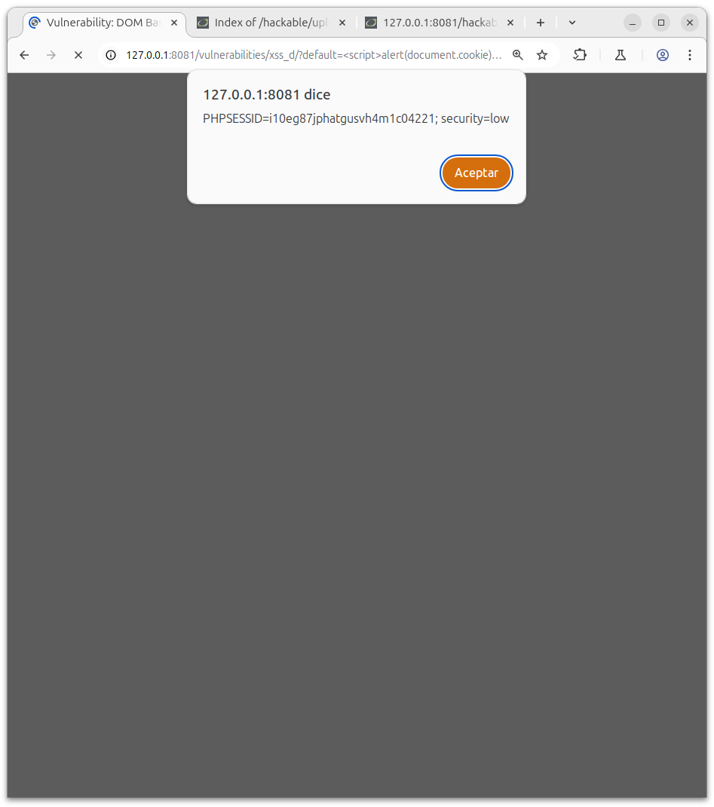

# Explotación de XSS Basado en DOM en DVWA

# Nivel de Seguridad: Low

## Observación

Existe una opción para seleccionar el idioma.

El valor seleccionado es reflejado directamente en el parámetro GET default=English.


## Explotación

Payload utilizado:
```
<script>alert(document.cookie);</script>
```
## Procedimiento:

Modificar el valor del parámetro default en la URL.

Inyectar el payload en dicho parámetro.

Resultado esperado:

Se dispara una ventana emergente (alert) mostrando las cookies actuales del navegador.

Ejemplo URL:
```
http://127.0.0.1:8081/vulnerabilities/xss_d/?default=<script>alert(document.cookie);</script>
```

Resultado:



# Nivel de Seguridad: Medium

## Observación

En este nivel, el valor del parámetro se inserta dentro de una etiqueta <option>, lo que complica la explotación directa.

Además, el uso de etiquetas <script> está restringido.

## Explotación

Para escapar de la etiqueta <option>, se debe cerrar manualmente las etiquetas HTML y aprovechar otra etiqueta que ejecute código, como "".

Payload utilizado:

```
" ></option></select>
```

## Procedimiento:

Modificar el valor del parámetro default insertando el payload anterior.

Inyectarlo correctamente para cerrar las etiquetas abiertas y ejecutar código.

Resultado esperado:

Se produce un alert con el contenido de las cookies, validando la explotación exitosa del XSS basado en DOM.

Ejemplo URL:

```
http://127.0.0.1:8081/vulnerabilities/xss_d/?default="%20></option></select>
```

(Asegurarse de codificar correctamente la URL si se inserta manualmente.)