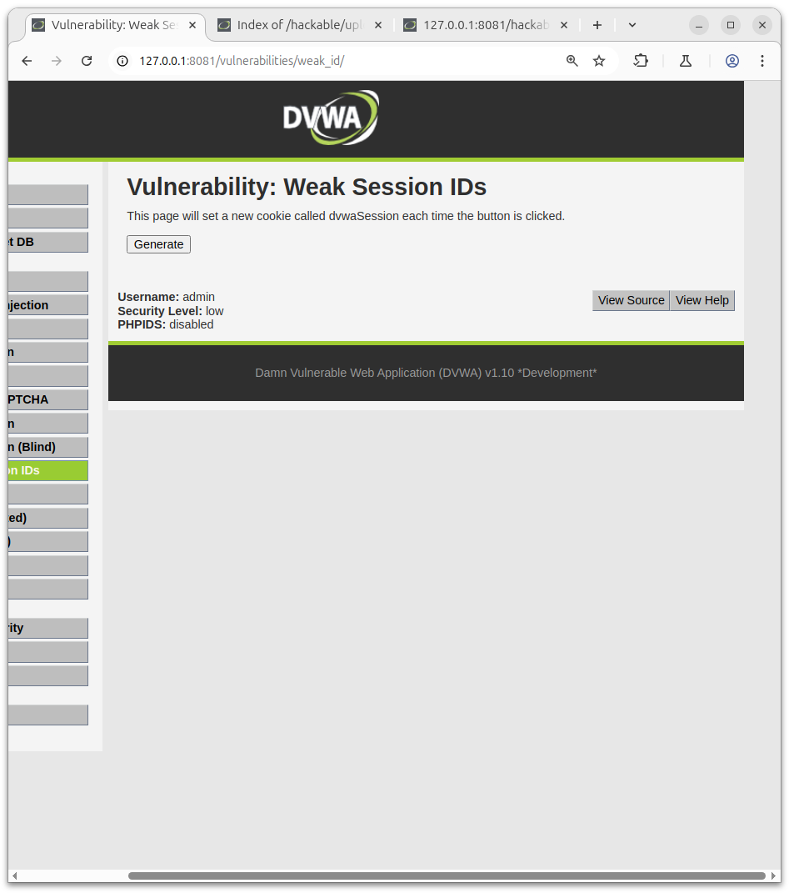
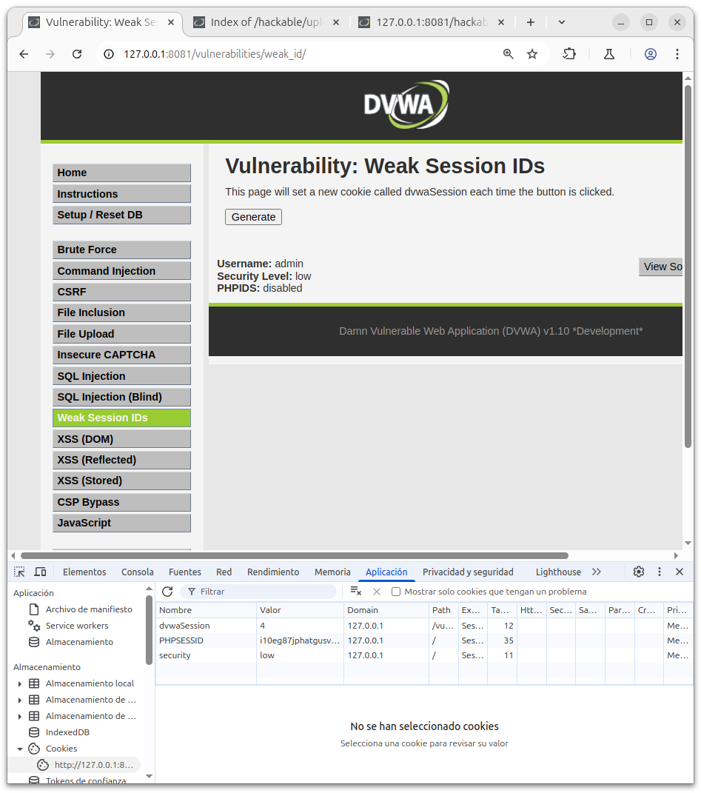

# WEAK SESSION IDs

## Security - Low

Este apartado tenemos un boton que nos genera una nueva cookie llamada "dvwaSession" cada vez que pulsamos el boton de generar.

Para observar lo anteriormente comentado pulsaremos F12, que nos abrira las herramientas de desarrollo del navegador.

En el apartado de aplicacion/almacenamiento/cookies podemos observar el aumento del numero de la cookie como se muestra en la siguiente captura:

