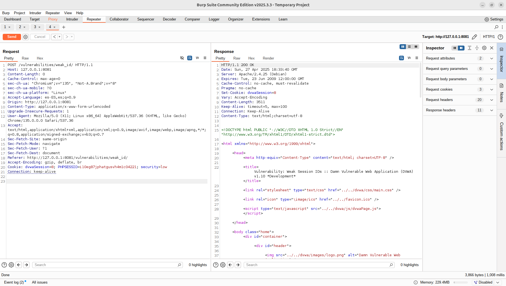
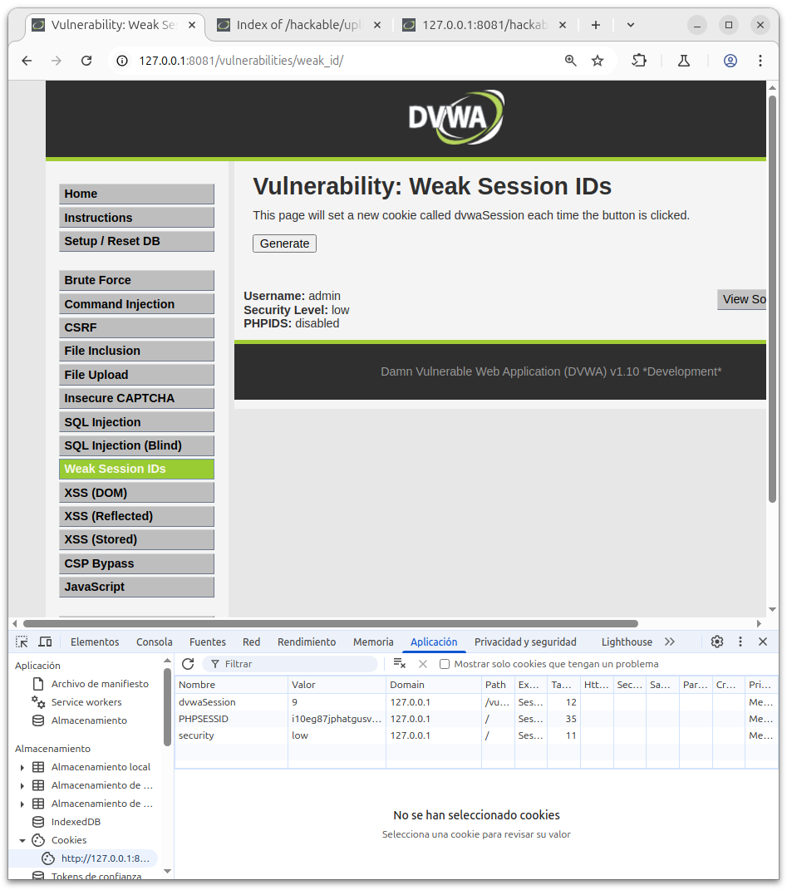
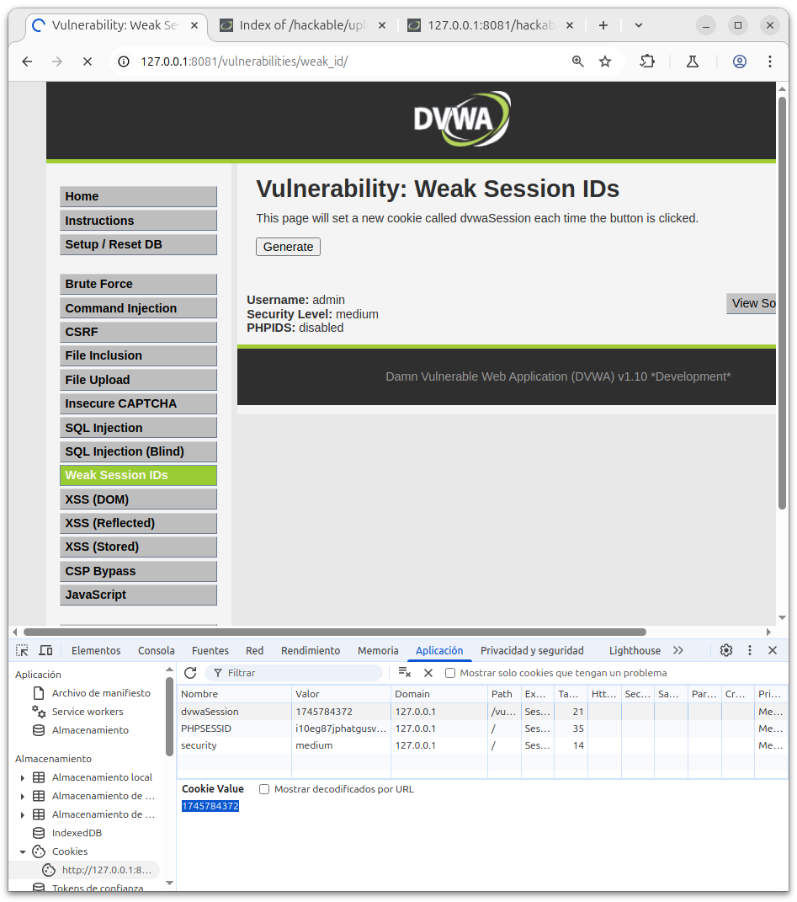
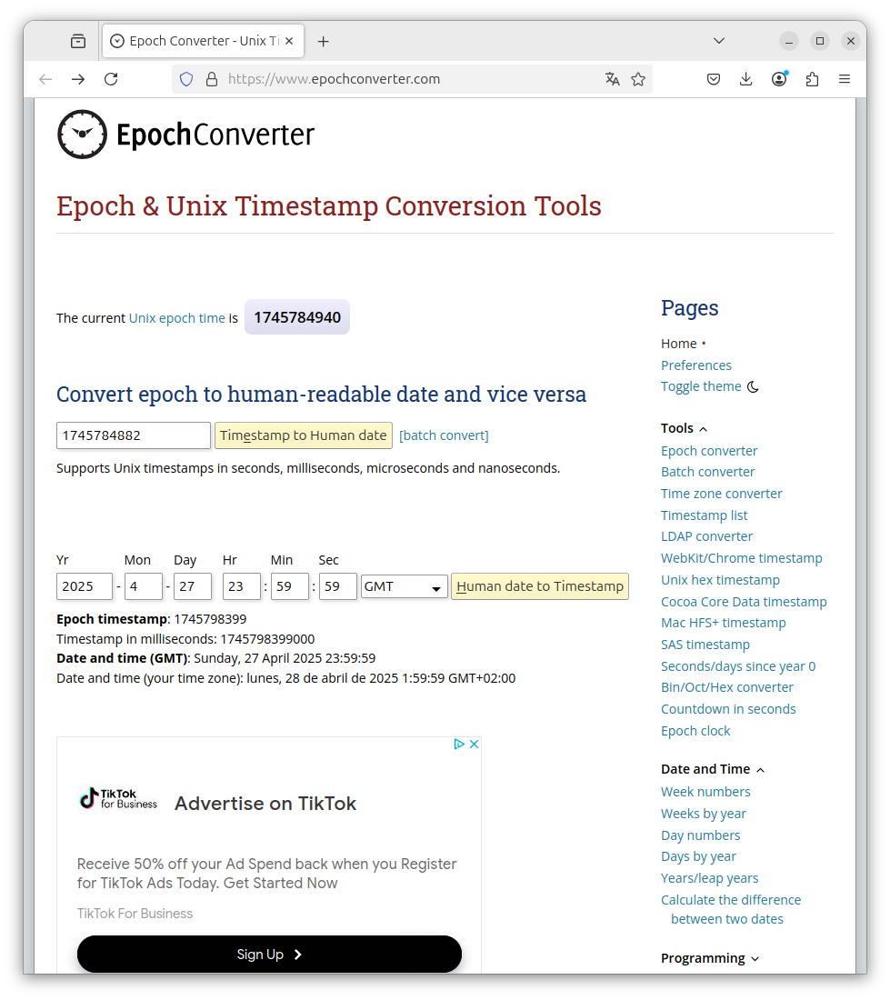
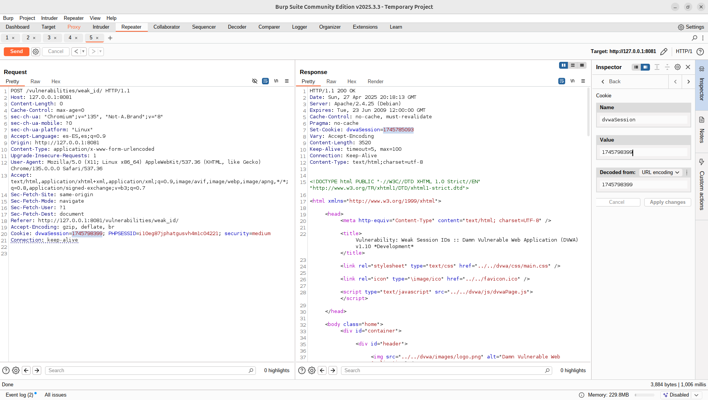

# WEAK SESSION IDs

## Security - Low

1. Este apartado tenemos un boton que nos genera una nueva cookie llamada "dvwaSession" cada vez que pulsamos el boton de generar.

2. Para observar lo anteriormente comentado pulsaremos F12, que nos abrira las herramientas de desarrollo del navegador.

En el apartado de aplicacion/almacenamiento/cookies podemos observar el aumento del numero de la cookie como se muestra en la siguiente captura:

3. Ahora con la herramienta de burpsuite vamos a captar una solicitud y cambiar la cookie con una nueva sesion, ya que solo tenemos que sumar +1 a la cookie actual.

Y la captura siguiente obtenemos el Resultado del mismo:

Y la comprobación:

## Security - Medium

1. Repitiendo la dinamica anterior en el primer paso se observa que la cookie es un timestamp:

    "El número 1745784372 es un timestamp, que representa los segundos desde el 1 de enero de 1970.
    Se utiliza en cookies para identificar sesiones o generar valores únicos de forma sencilla.
    Al ser basado en el tiempo actual, garantiza que cada valor sea diferente casi siempre.
    El servidor lo puede enviar en una cookie como Set-Cookie: session=1745784372.
    Así se registra la fecha y hora de conexión o se identifica una sesión de usuario."

2. El siguiente paso seria utilizar una cookie con nuestro tiempo que queramos:
    Usaremos el siguiente enlace [Calculadore tiempo Unix](https://www.epochconverter.com/) obtendremos un numero para la cookie que podremos aplicar.

Captura de la calculadora de timestamp:

3. Y obtendremos nuestra cookie modificada:

