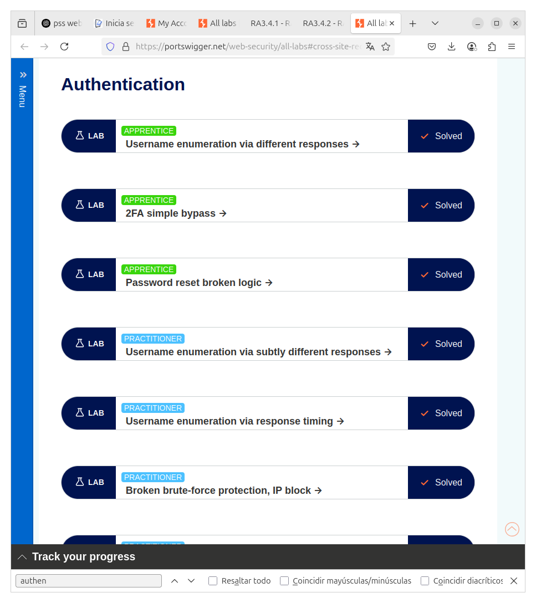
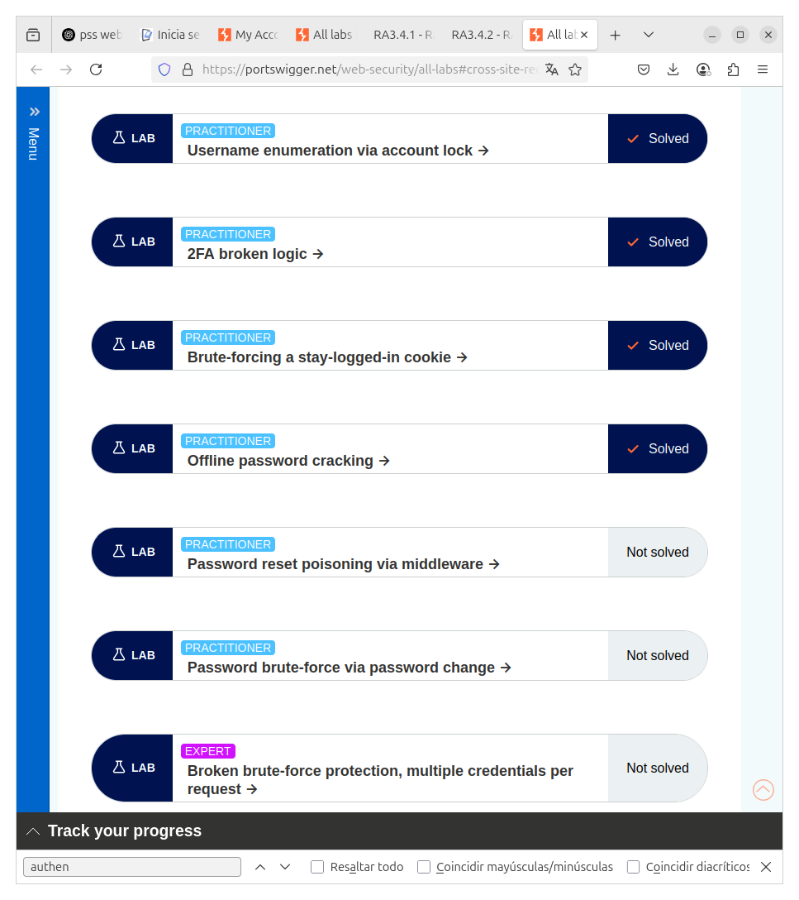

# BURP SUITE - ACTIVIDAD RA3.4.1
##
---

## Parte 1 - Authentication

APPRENTICE  
- Username enumeration via different responses  
- 2FA simple bypass  
- Password reset broken logic  

PRACTITIONER  
- Username enumeration via subtly different responses  
- Username enumeration via response timing  
- Broken brute-force protection, IP block  
- Username enumeration via account lock  
- 2FA broken logic  
- Brute-forcing a stay-logged-in cookie  
- Offline password cracking  

Captura de los Laboratorios:  

---

## Parte 2 - File Path Traversal

APPRENTICE  
- File path traversal, simple case  

PRACTITIONER  
- Traversal sequences blocked with absolute path bypass  
- Traversal sequences stripped non-recursively  
- Traversal with superfluous URL-decode  
- Validation of start of path  
- Validation of file extension with null byte bypass  

Captura de los Laboratorios:  

---

## Parte 3 - OS Command Injection

APPRENTICE  
- OS command injection, simple case  

PRACTITIONER  
- Blind OS command injection with time delays  
- Blind OS command injection with output redirection  

Captura de los Laboratorios:  

---

## Parte 4 - Information Disclosure

APPRENTICE  
- Info disclosure in error messages  
- Info disclosure on debug page  
- Source code disclosure via backup files  
- Authentication bypass via info disclosure  

PRACTITIONER  
- Info disclosure in version control history  

Captura de los Laboratorios:  

---

## Parte 5 - Access Control

APPRENTICE  
- Unprotected admin functionality  
- Unprotected admin functionality with unpredictable URL  
- User role controlled by request parameter  
- User role can be modified in user profile  

PRACTITIONER  
- URL-based access control bypass  

Captura de los Laboratorios:  

---

## Parte 6 - File Upload

APPRENTICE  
- Remote code execution via web shell upload  

Captura de los Laboratorios:  

---

## Parte 7 - Server-Side Request Forgery (SSRF)

APPRENTICE  
- Basic SSRF against the local server  
- Basic SSRF against another back-end system  

PRACTITIONER  
- SSRF with blacklist-based input filter  
- SSRF with open redirect filter bypass  

Captura de los Laboratorios:  

---

## Parte 8 - API Testing

APPRENTICE  
- Exploiting an API endpoint using documentation  

PRACTITIONER  
- Finding and exploiting an unused API endpoint  
- Exploiting a mass assignment vulnerability  

Captura de los Laboratorios:  

---
