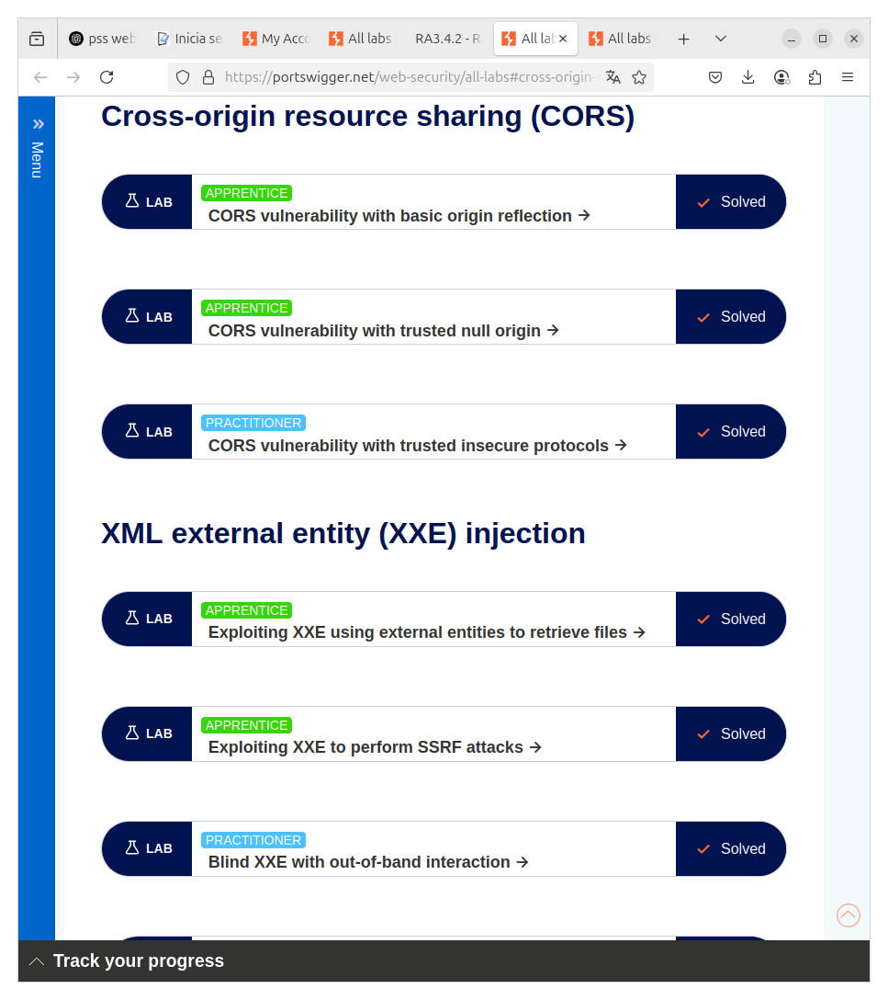
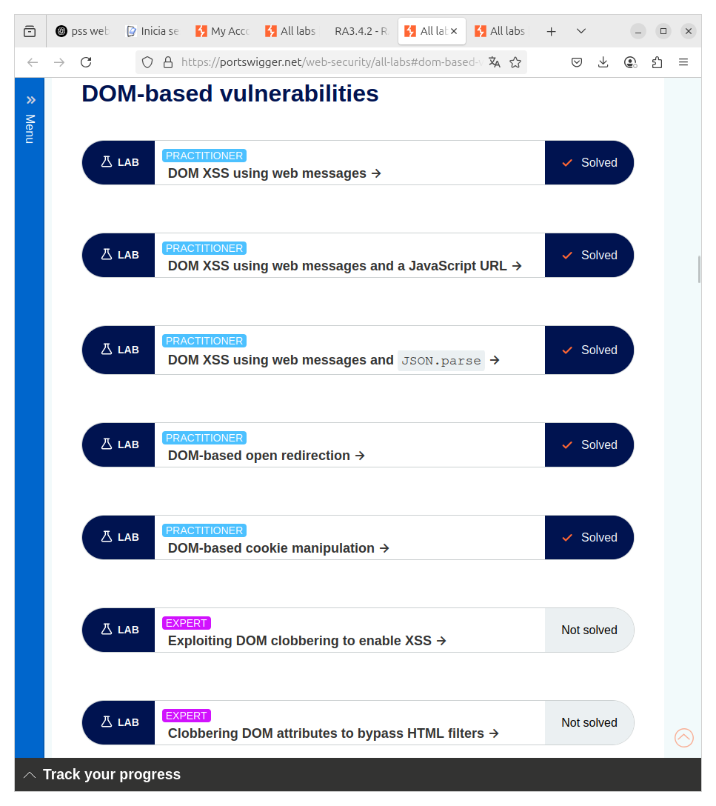

# BURP SUITE - ACTIVIDAD RA3.4.2
##
---

## Parte 1 - Cross-Site Request Forgery (CSRF)

APPRENTICE  
- CSRF vulnerability with no defenses  

PRACTITIONER  
- CSRF where token validation depends on request method  
- CSRF where token validation depends on token being present  

Captura de los Laboratorios:  

---

## Parte 2 - Cross-Origin Resource Sharing (CORS)

APPRENTICE  
- CORS vulnerability with basic origin reflection  
- CORS vulnerability with trusted null origin  

PRACTITIONER  
- CORS vulnerability with trusted insecure protocols  

Captura de los Laboratorios:  

---

## Parte 3 - DOM-Based Vulnerabilities

PRACTITIONER  
- DOM XSS using web messages  
- DOM XSS using web messages and a JavaScript URL  
- DOM XSS using web messages and JSON.parse  
- DOM-based open redirection  
- DOM-based cookie manipulation  

Captura de los Laboratorios:  

---

## Parte 4 - Cross-Site Scripting (XSS)

APPRENTICE  
- Reflected XSS into HTML context with nothing encoded  
- Stored XSS into HTML context with nothing encoded  
- DOM XSS in document.write sink using location.search  
- DOM XSS in innerHTML sink using location.search  
- DOM XSS in jQuery anchor href attribute sink  
- DOM XSS in jQuery selector sink using hashchange event  
- Reflected XSS into attribute with angle brackets HTML-encoded  
- Stored XSS into anchor href with double quotes HTML-encoded  
- Reflected XSS into a JavaScript string with angle brackets HTML-encoded  

PRACTITIONER  
- DOM XSS in document.write inside select element  
- DOM XSS in AngularJS expression (HTML-encoded)  
- Reflected DOM XSS  
- Stored DOM XSS  
- Reflected XSS with most tags and attributes blocked  
- Reflected XSS with all tags blocked except custom  
- Reflected XSS with some SVG markup allowed  
- Reflected XSS in canonical link tag  
- Reflected XSS into JS string with single quote and backslash escaped  
- Reflected XSS into JS string with angle brackets and double quotes HTML-encoded and single quotes escaped  
- Stored XSS into onclick with full escaping  
- Reflected XSS into a template literal with all dangerous characters encoded  

Captura de los Laboratorios:  

---
