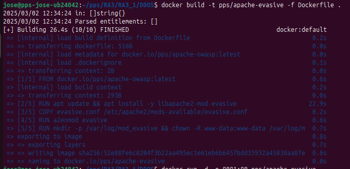
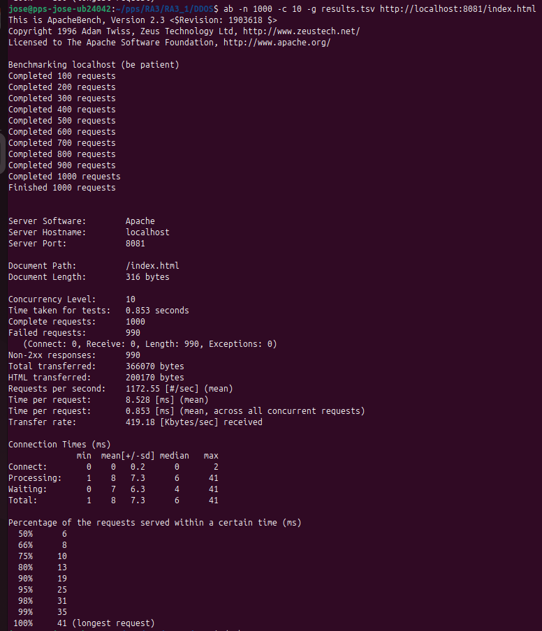
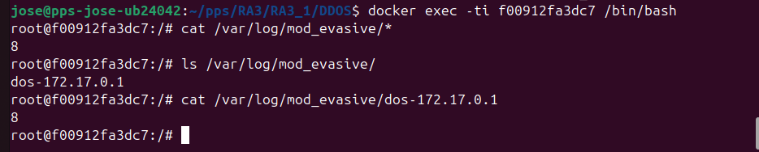

# Instalación y Configuración de mod_evasive en Apache

## ** Descripción**
En esta sección, hemos instalado y configurado **mod_evasive** en Apache. Este módulo protege el servidor contra ataques de **Denegación de Servicio (DoS)** al bloquear automáticamente direcciones IP que excedan un umbral de peticiones.

## ** Pasos Realizados**

### ** 1 Instalación de `mod_evasive` en el Contenedor**
- Se ha instalado `libapache2-mod-evasive` en Apache.
- Se ha copiado el archivo de configuración `evasive.conf` en `/etc/apache2/mods-available/`.
- Se ha habilitado el módulo con `a2enmod evasive`.

### ** 2 Modificación de la Configuración en `evasive.conf`**
Se han aplicado los siguientes ajustes en `evasive.conf`:
```apache
<IfModule mod_evasive20.c>
    DOSHashTableSize 3097
    DOSPageCount 5
    DOSSiteCount 50
    DOSPageInterval 1
    DOSSiteInterval 1
    DOSBlockingPeriod 10
    DOSEmailNotify admin@tu-dominio.com
    DOSLogDir "/var/log/mod_evasive"
</IfModule>
```

 **Esto asegura que `mod_evasive` bloquee ataques de DoS de manera efectiva.**

### ** 3 Creación de la Imagen Docker con `mod_evasive`**
Se ha modificado el `Dockerfile` para incluir `mod_evasive`:
```dockerfile
FROM pps/apache-owasp

RUN apt update && apt install -y libapache2-mod-evasive

COPY evasive.conf /etc/apache2/mods-available/evasive.conf

RUN a2enmod evasive

RUN mkdir -p /var/log/mod_evasive && chown -R www-data:www-data /var/log/mod_evasive

CMD ["apache2ctl", "-D", "FOREGROUND"]
```
 **Esto garantiza que `mod_evasive` se instale y se active automáticamente en cada contenedor.**

### ** 4 Construcción y Ejecución del Contenedor**
Ejecutamos los siguientes comandos para construir y probar la imagen Docker:
```sh
docker build -t pps/apache-evasive -f Dockerfile .
docker run -d -p 8081:80 pps/apache-evasive
```

### ** 5️ Pruebas de Seguridad con Apache Bench (`ab`)**
Para verificar que `mod_evasive` está bloqueando ataques, ejecutamos una prueba de carga:

```sh
ab -n 1000 -c 10 http://localhost:8081/index.html
```
 **Si `mod_evasive` está funcionando, bloqueará IPs después de alcanzar el umbral configurado.**

🔹 **Verificamos los logs de `mod_evasive` para ver las IPs bloqueadas:**
```sh
cat /var/log/mod_evasive/*
```
 **Si `mod_evasive` está activo, veremos registros de direcciones IP bloqueadas.**

### ** 6️ Generación de Informe de Apache Bench (`ab`)**
Ejecutamos la prueba de carga y generamos un informe en formato TSV:
```sh
ab -n 1000 -c 10 -g results.tsv http://localhost:8081/index.html
```

Informe:  
[Infome TSV](./results.tsv)

 **Este archivo puede abrirse en Excel o Google Sheets para analizar el rendimiento del servidor.**

---

## **🔹 Capturas de Pantalla**
  
  Captura de la modificaion del archivo de configuracion del apache:  
  
  
  Captura del apache2.conf:  
  

  Captura del Dockerfile:  
  
    
  Comprobacion del servicio:  
  
 
  Ips Bloqueadas:  
  

---

## **🔹 Pull del Contenedor en Docker Hub**
Cuando Docker Hub esté configurado, la imagen podrá descargarse con:
```sh
docker pull https://hub.docker.com/repository/docker/pss13030596/apache2-evasive/
```

---