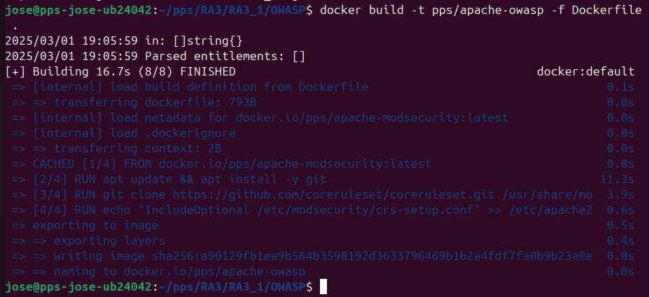
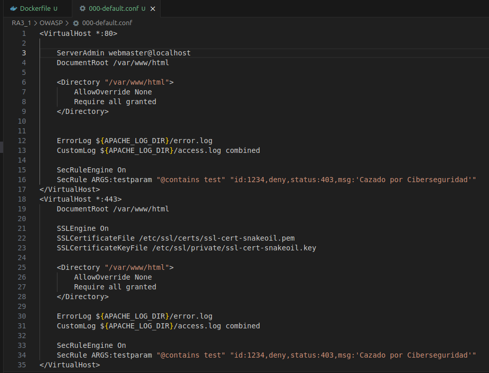
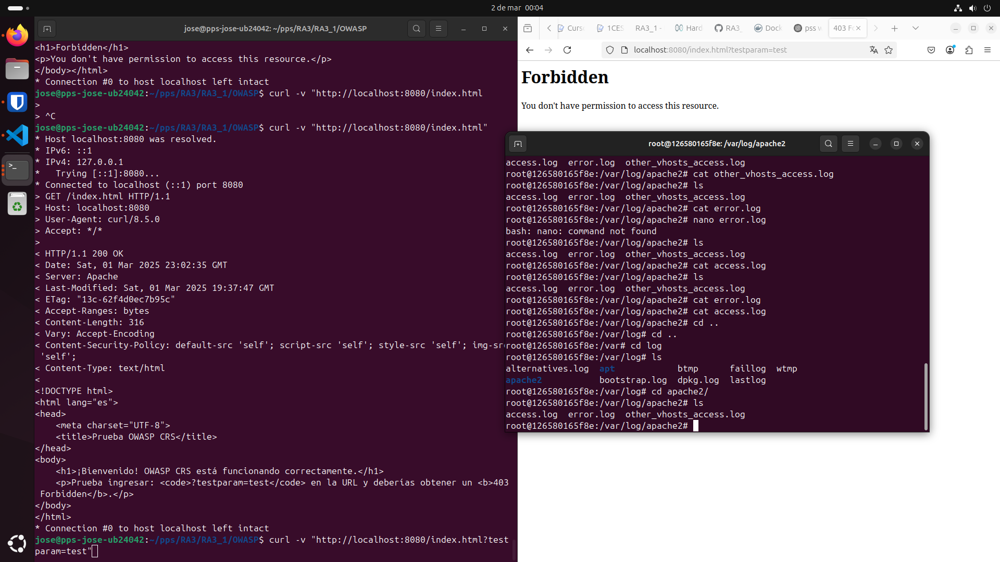
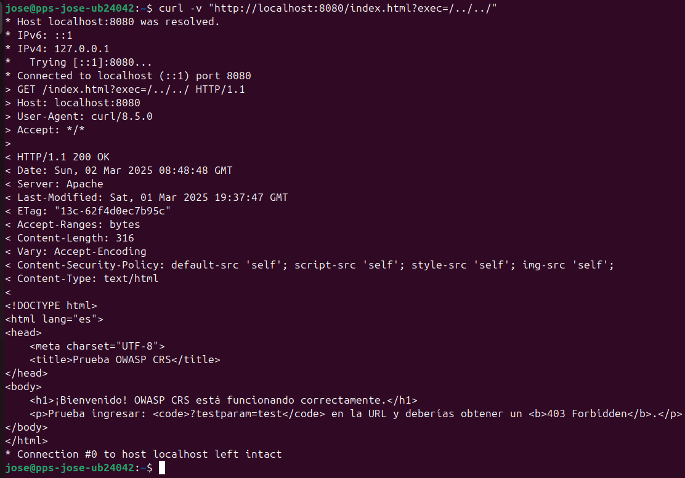
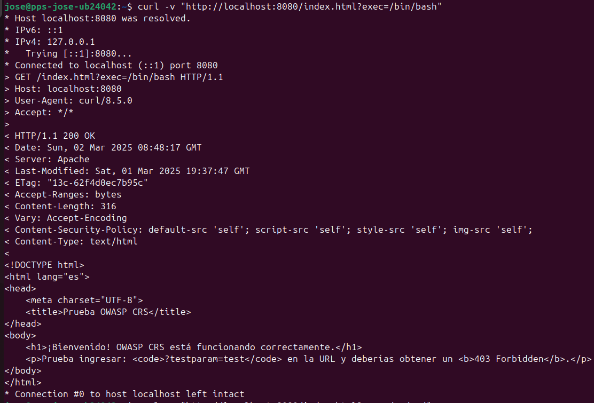
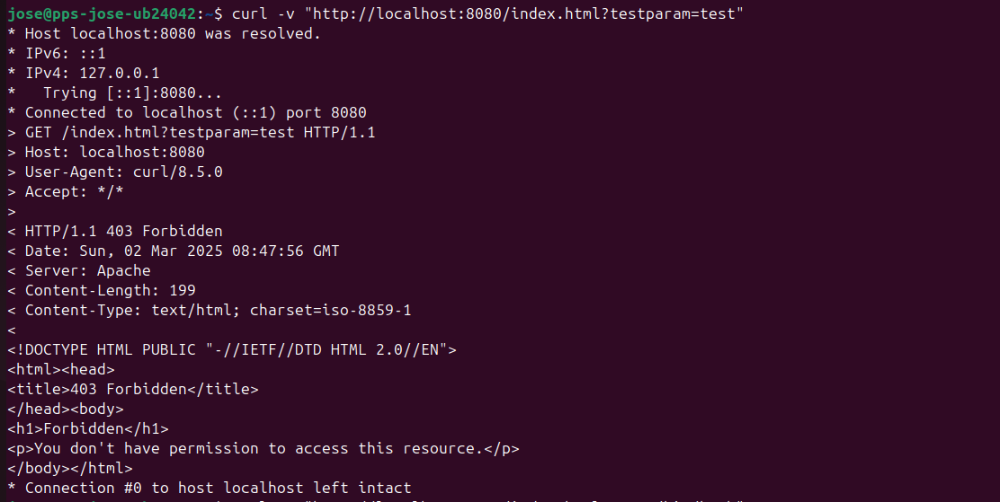

# Instalación y Configuración de OWASP CRS con ModSecurity

## ** Descripción**
En esta sección, hemos instalado y configurado **OWASP Core Rule Set (CRS)** en Apache con **ModSecurity**. Este conjunto de reglas ayuda a proteger el servidor contra ataques como:

- Inyección SQL (SQLi)  
- Cross-Site Scripting (XSS)  
- Ataques de fuerza bruta  
- Command Injection  
- Path Traversal  

## ** Pasos Realizados**

### ** 1 Instalación de OWASP CRS en el Contenedor**
- Se ha clonado el repositorio oficial de OWASP CRS en `/etc/modsecurity/crs/`.
- Se ha movido el archivo de configuración `crs-setup.conf` a `/etc/modsecurity/`.
- Se han copiado las reglas CRS al directorio de reglas de ModSecurity.

### **2️⃣ Modificación de Configuración en Apache**
Se han realizado los siguientes ajustes en **`security2.conf`** para asegurar que OWASP CRS cargue correctamente:
```apache
<IfModule security2_module>
	# Default Debian dir for modsecurity's persistent data
	SecDataDir /var/cache/modsecurity
	SecRuleEngine On
	# Keeping your local configuration in that directory
	# will allow for an easy upgrade of THIS file and
	# make your life easier
    #IncludeOptional /etc/modsecurity/*.conf
	#Include /etc/modsecurity/rules/*.conf	

	#Include OWASP MODSECURITY CRS rules if installed
	IncludeOptional /etc/modsecurity/crs/*.load
</IfModule>
```

 **Esto asegura que las reglas OWASP CRS sean la única fuente de reglas activas.**

### ** 3 Creación de la Imagen Docker con OWASP CRS**
Se ha modificado el `Dockerfile` para incluir OWASP CRS:
```dockerfile
# Usa la imagen con ModSecurity como base
FROM pps/apache-modsecurity

# Instalar Git (necesario para descargar OWASP CRS)
RUN apt update && apt install -y git

# Descargar OWASP CRS
RUN git clone https://github.com/SpiderLabs/owasp-modsecurity-crs.git /usr/share/modsecurity/owasp-crs \
    && mv /usr/share/modsecurity/owasp-crs/crs-setup.conf.example /etc/modsecurity/crs-setup.conf \
    && cp /usr/share/modsecurity/owasp-crs/rules/* /etc/modsecurity/crs/

# Copiar archivos de configuración de OWASP CRS
COPY security2.conf /etc/apache2/mods-enabled/security2.conf
COPY crs-setup.conf /etc/modsecurity/crs-setup.conf
COPY 000-default.conf /etc/apache2/sites-available/000-default.conf
COPY apache2.conf /etc/apache2/apache2.conf
COPY index.html /var/www/html/index.html

# Asignar permisos adecuados
RUN chown -R www-data:www-data /var/www/html /etc/modsecurity \
    && chmod -R 775 /var/www/html /etc/modsecurity

# Ejecutar Apache en primer plano
CMD ["apache2ctl", "-D", "FOREGROUND"]
```
 **Esto asegura que Apache cargue correctamente OWASP CRS y su configuración.**

### ** 4 Construcción y Ejecución del Contenedor**
Ejecutamos los siguientes comandos para construir y probar la imagen Docker:
```sh
docker build -t pps/apache-owasp -f Dockerfile .
docker run -d -p 8080:80 pps/apache-owasp
```

### ** 5 Pruebas de Seguridad**
Se realizaron las siguientes pruebas para validar que OWASP CRS bloquea ataques:

🔹 **Prueba de SQL Injection:**
```sh
curl -v "http://localhost:8080/index.html?testparam=test"
```
 **Debe devolver `403 Forbidden`**

🔹 **Prueba de Command Injection:**
```sh
curl -v "http://localhost:8080/index.html?exec=/bin/bash"
```
 **Debe devolver `403 Forbidden`**

🔹 **Prueba de Path Traversal:**
```sh
curl -v "http://localhost:8080/index.html?exec=/../../"
```
 **Debe devolver `403 Forbidden`**

### ** 6 Capturas**
Creacion de la imagen:  


Cambios en el 000-Default:  
  

Comprobaciones:  
  
  
  


Nota: si es cierto que no esta funcionando correctamente y se deja pendiente de revison/cambio.

## **🔹 Pull del Contenedor en Docker Hub**
Cuando Docker Hub esté configurado, la imagen podrá descargarse con:
```sh
docker pull https://hub.docker.com/repository/docker/pss13030596/apache-owasp
```

---
