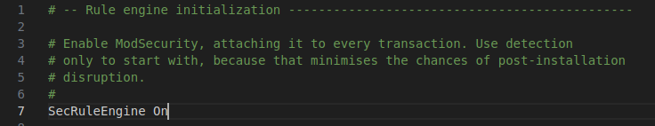
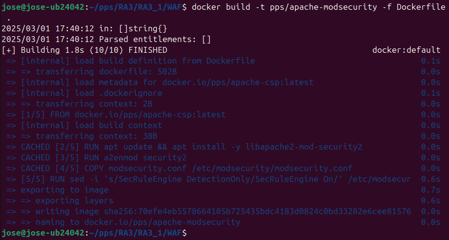
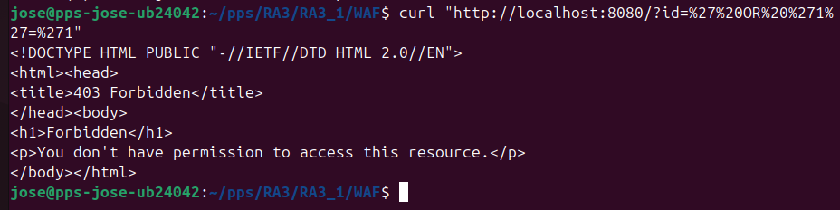

# Web Application Firewall (WAF) - ModSecurity

## **🔹 Descripción**
En esta práctica, se implementa **ModSecurity** como un **Web Application Firewall (WAF)** en un servidor Apache dentro de un contenedor Docker. ModSecurity ayuda a proteger el servidor de ataques como:
- Inyección SQL (SQLi)
- Cross-Site Scripting (XSS)
- Inclusión de archivos remotos (RFI)
- Ataques de fuerza bruta

---

## **🔹 Modificaciones Realizadas**

### ** 1 Archivo `modsecurity.conf` (Configuración de ModSecurity)**
Se copió y modificó el archivo `/etc/modsecurity/modsecurity.conf`:

```apache
SecRuleEngine On
```
  **Efecto:** Ahora ModSecurity **bloqueará ataques** en lugar de solo detectarlos.

---

### ** 2 Archivo `Dockerfile` (Dockerización de ModSecurity)**
Se creó el `Dockerfile` con la siguiente configuración:

```dockerfile
# Usa la imagen con CSP como base
FROM pps/apache-csp

# Instalar ModSecurity
RUN apt update && apt install -y libapache2-mod-security2

# Activar ModSecurity en Apache
RUN a2enmod security2

# Configurar ModSecurity para bloquear ataques en vez de solo detectarlos
COPY modsecurity.conf /etc/modsecurity/modsecurity.conf
RUN sed -i 's/SecRuleEngine DetectionOnly/SecRuleEngine On/' /etc/modsecurity/modsecurity.conf

# Reiniciar Apache al iniciar el contenedor
CMD ["apachectl", "-D", "FOREGROUND"]
```
  **Efecto:** Crea un contenedor con ModSecurity activado en Apache.

---

## **🔹 Validación**
Para verificar que ModSecurity está correctamente configurado en el contenedor:

1. **Construir la imagen Docker**:
   ```sh
   docker build -t pps/apache-modsecurity -f Dockerfile .
   ```
2. **Ejecutar el contenedor**:
   ```sh
   docker run -d -p 8080:80 pps/apache-modsecurity
   ```
3. **Comprobar si ModSecurity está activo**:
   ```sh
   curl -I http://localhost:8080
   ```
     **Salida esperada**: La cabecera de respuesta debe indicar que ModSecurity está activado.

4. **Prueba de ataque SQL Injection**:
   ```sh
   curl "http://localhost:8080/?id=%27%20OR%20%271%27=%271"
   ```
     **Esperado**: ModSecurity debe **bloquear la solicitud** y devolver un código **403 Forbidden**.

---

## **🔹 Capturas de Pantalla**


Cambios del ModSecurity.conf:  

    
Creacion de la imagen:  


Comprobacion de los cambios realizados:  


---

## **🔹 Pull del Contenedor en Docker Hub**
Cuando Docker Hub esté configurado, la imagen podrá descargarse con:
```sh
docker pull pps/apache-modsecurity
```

---
